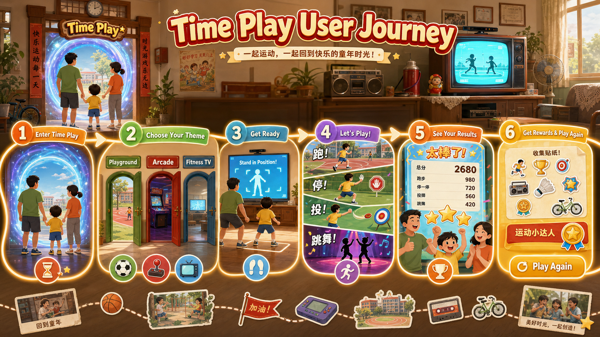

# MotionX Retro Pack / 用户体验旅程

> 本文基于现有产品定义、结构蓝图、云端编排、单局流程、奖励和付费设计整理，用于说明家庭用户从首次看到 `时光体感馆 / Time Play` 到完成复玩和长期回访的完整体验。产品总定义见 [MotionX-Retro-Pack-产品定义](../项目管理计划/MotionX-Retro-Pack-产品定义.md)，单局流程见 [单个复古体感游戏标准流程_参考](../单个复古体感游戏标准流程_参考.md)，`童年的一天` 编排边界见 [童年的一天_云端内容编排关系](./童年的一天_云端内容编排关系.md)。

## 1. 旅程结论

| 结论项 | 定义 |
| --- | --- |
| 核心旅程 | 家长被童年场景触发，带孩子进入 `时光体感馆`，选择主题馆，完成 1-3 分钟短局，通过结算和奖励形成家庭话题，再被轻挑战和主题内容拉回 |
| 首要用户 | 30-45 岁家长是发起者和情绪买单者，5-12 岁儿童是持续游玩的关键判断者 |
| 体验目标 | 父母愿意说“这是我小时候玩的”，孩子愿意说“再来一局” |
| MVP 入口 | `首页 -> 时光体感馆 -> 主题馆 -> 选择一个具体游戏 -> 该游戏入戏开场 -> 游戏中 -> 结算 -> 奖励卡片` |
| 成长期入口 | 内容达到 10-20 个后，增加 `童年的一天` 编排路线，但不替代主题馆直接入口 |
| 关键红线 | `童年的一天` 不是第四个主题馆，不复制内容库，不强制通关，不在客户端写死固定顺序 |

一句话：

> 用户不是来浏览一组复古游戏，而是被邀请在今天的客厅里，和家人重新玩一次爸妈小时候的课间、街机和电视健身。

## 2. 用户体验旅程图



> 这张图用于快速表达 MVP 体验闭环：用户从首页进入 `时光体感馆`，选择主题馆，再选择一个具体游戏，完成该游戏的入戏开场、识别和 1-3 分钟短局，最后通过结算、奖励卡片和 `Play Again` 形成复玩。

## 3. 目标用户与体验动机

| 用户角色 | 进入动机 | 主要顾虑 | 体验需要满足什么 |
| --- | --- | --- | --- |
| 家长 / 父母 | 想让孩子动起来，也想把自己的童年经验带进亲子时间 | 不想太复杂，不想变成孩子付费索取，不希望体验尴尬或过时 | 一眼知道这是家庭游戏；能快速发起；能和孩子产生共同话题 |
| 儿童 | 想要规则简单、反馈快、有奖励、能赢也能笑 | 不理解父母的怀旧符号；等待太久会失去兴趣 | 5 秒知道做什么；30 秒内开始玩；失败也不挫败；奖励看得懂 |
| 旁观家庭成员 | 想看懂场上发生什么，必要时加入下一局 | 看不懂规则或不知道何时上场 | 大屏信息清晰；反馈有趣；支持轮流、分队或同屏 |
| 渠道 / OEM 演示用户 | 想快速看见家庭娱乐卖点 | 演示链路过长、玩法解释成本高 | 从入口到一局闭环必须短、清楚、可复述 |

## 4. MVP 用户旅程总览

```text
看见入口
  -> 进入时光体感馆
  -> 选择主题馆
  -> 选择一个具体游戏
  -> 该游戏入戏开场
  -> 入戏式识别
  -> 亲子 / 多人角色确认
  -> 1-3 分钟核心玩法
  -> 欢乐反馈
  -> 结算界面
  -> 奖励卡片
  -> 再来一局 / 换主题 / 查看收藏
```

| 阶段 | 用户行为 | 用户心理 | 产品触点 | 体验设计重点 | 成功标准 |
| --- | --- | --- | --- | --- | --- |
| 1. 发现入口 | 在首页看到 `时光体感馆 / Time Play` | 这是什么？适合我家玩吗？ | 首页入口、主题图、短文案 | 不直接平铺大量游戏，不放相机状态和技术信息 | 家长能理解这是家庭体感主题入口 |
| 2. 建立期待 | 进入后看到童年操场、客厅街机、家庭电视健身 | 这里有我熟悉的场景，孩子也能玩 | 主题馆列表 / 场景化导航 | 主题体验为主，怀旧元素为辅；不要做成设置菜单 | 用户能在 5 秒内知道每个主题大概玩什么 |
| 3. 选择游戏 | 在当前主题馆下选择一个具体游戏，例如操场木头人、电玩城投篮机、家庭电视健美操 | 先试一个最容易懂的 | 游戏卡片、人数、时长、强度、状态 | 明确 1-3 分钟短局；进入后只服务这一局，不把主题馆内其他游戏串进来 | 用户能在 30 秒内进入一局 |
| 4. [回忆开场](./MotionX-Retro-Pack-入戏开场设计指南.md) | 看当前游戏的 10-20 秒场景引入 | 进入这个已选择的游戏场景，而不是打开一个普通运动小游戏 | 当前游戏对应的声音、目标物、站位区和动作提示 | 只表现当前游戏；不展示同主题馆其他游戏；不做多游戏串联；不做长剧情 | 用户愿意等完开场，并知道这一局具体要做什么 |
| 5. 入戏识别 | 站到摄像头前准备上场 | 我该站哪里？现在是不是能开始？ | 站位引导、颜色区、倒计时 | 不说“正在校准”，改成“准备上场”“站到队伍里”“投币成功” | 识别等待不打断沉浸，用户知道如何调整站位 |
| 6. 角色确认 | 父母示范、孩子挑战、亲子组队或轮流 | 谁先来？我能不能和孩子一起玩？ | 队伍确认、玩家颜色、轮流提示 | 首版优先粗粒度多人，不做精确同步率 | 家庭成员知道自己的参与位置 |
| 7. 核心玩法 | 跑停、挥臂、抬膝、投篮、跟做 | 原来就是这样玩，很快能上手 | 大屏 HUD、动作反馈、音效 | 只使用稳定 2D 动作原语；规则场景化 | 5 秒知道动作目标，30 秒学会 |
| 8. 欢乐反馈 | 成功、失败、连击、停住、命中 | 错了也好笑，不尴尬 | 场景文案、音效、分数变化 | 轻松但不羞辱；父母和孩子都能接受 | 失败不导致退出，旁观者能看懂 |
| 9. 结算界面 | 看分数、称号、回忆标签、同步感 | 这一局有什么结果？我们表现如何？ | 分数、称号、回忆标签、同步感三档 | 结算先服务清楚结果，童年元素只做包装 | 用户知道赢在哪里，也知道下一步做什么 |
| 10. 奖励卡片 | 获得贴纸、徽章或称号 | 有东西被记住了，可以再玩一次 | 奖励卡片、收藏入口、继续按钮 | 奖励通过游玩解锁，不收费；每局最多弹出 1 张 | 奖励推动复玩，不干扰下一局 |
| 11. 复玩选择 | 再来一局、换主题、看收藏 | 还可以玩别的吗？能不能挑战爸妈？ | 再来一次、换主题、每日/周末挑战 | 给明确下一步，不做复杂任务链 | 形成再来一局或换主题行为 |

## 5. 关键体验时刻

| 体验时刻 | 用户要感受到什么 | 设计要点 | 不应该出现什么 |
| --- | --- | --- | --- |
| 首页第一次看到入口 | 这是一个全家能玩的主题馆，不是普通游戏列表 | `时光体感馆 / Time Play` 要作为清晰入口；主视觉给家庭、运动、童年场景暗示 | 摄像头已就绪、算法说明、过多设备状态 |
| 主题馆选择 | 每个主题馆有不同场景和玩法期待 | 童年操场偏跑跳停，客厅街机偏短局刷分，家庭电视健身偏跟做和亲子同步 | 三个入口文案相似，点击后体验差不多 |
| 游戏选择 | 用户在主题馆内只选择一个具体游戏 | 游戏卡片要明确目标、人数、时长、强度；进入后只播放该游戏开场 | 用主题馆介绍片或合集开场替代单游戏开场 |
| 入戏识别 | 站位和等待也是体验的一部分 | 把校准包装成“站队”“上场”“投币”“录像带开始” | “骨骼识别中”“校准失败”“算法检测”这类技术语言 |
| 第一局前 30 秒 | 孩子立刻知道动作，家长愿意示范 | 大动作、少规则、强反馈；必要信息 3 米外可读 | 长教程、复杂按钮、多个确认弹窗 |
| 第一局结束 | 家庭知道这一局发生了什么 | 分数、称号、回忆标签、同步感三档、清楚的下一步按钮 | 只给数字分，不给家庭话题 |
| 奖励出现 | 奖励是一起玩出来的，不是付费买来的 | 贴纸、徽章、称号、家庭奖励优先 | 买贴纸、买称号、抽卡、复活、体力 |

## 6. 主题馆旅程差异

| 主题馆 | 入口期待 | 典型游戏 | 单局情绪 | 结算记忆 | 适合复玩钩子 |
| --- | --- | --- | --- | --- | --- |
| 童年操场 | 课间、操场、全家一起跑跳 | 操场木头人、跳房子、躲沙包、踢毽子 | 热闹、跑停、多人参与 | 课间小冠军、最稳木头人、全家最稳同桌 | 家庭多人挑战、孩子挑战父母、课间贴纸 |
| 客厅街机 | 放学后、投币、刷分、排行榜 | 电玩城投篮机、拳击机、打地鼠、街机闪避跑 | 爽快、竞技、短局高频 | 放学后投篮王、客厅街机王、高分上墙 | 再来一次、刷新分数、本地榜 |
| 家庭电视健身 | 老电视、饭后、一起跟练 | 家庭电视健美操、拳击操、亲子拉伸 | 温馨、轻健身、亲子同步 | 家庭电视健身队、全家节拍对上了 | 每日跟练、低强度亲子局、同步徽章 |
| 节日游园会 | 周末、庙会、奖励、活动 | 套圈、扔沙包、保龄球、节日挑战 | 轻松、番外、赢小奖 | 游园小能手、全家中奖队 | 周末家庭赛、节日限定贴纸 |
| 西游童年神话 | 国内神话童年、幻想挑战 | 火焰山、蟠桃园、筋斗云、白骨精挑战 | 奇幻、亲子、节假日 | 童年神话挑战完成 | 第二批 / 节假日主题活动 |

## 7. `童年的一天` 编排旅程

`童年的一天` 适合内容达到 10-20 个后作为体验路线激活。它从主题馆内容池中取内容，按时间、情绪和运动强度串联，不直接生产一套新内容。

```text
首页
  -> 童年的一天
  -> 清晨·上学路上
  -> 上午·课间操场
  -> 下午·放学之后
  -> 傍晚·回到家里
  -> 周末·节日游园
```

| 时段 | 体验目标 | 主要内容来源 | 用户感受 | 设计重点 |
| --- | --- | --- | --- | --- |
| 清晨·上学路上 | 慢热、入戏、轻校准 | 电视健美操 / 童年操场轻量内容 | 准备出门，先动起来 | 把站位识别包装成背书包、站队、赶上铃声 |
| 上午·课间操场 | 热闹、多人、跑跳停 | 童年操场 | 全家上场，第一个高潮 | 跑停、冻结、跳跃、躲闪必须有课间动作理由 |
| 下午·放学之后 | 爽感、竞技、刷分 | 客厅街机 | 放学后冲高分 | 排行榜、投币、爆灯、加时等短局反馈 |
| 傍晚·回到家里 | 降强度、亲子陪伴、跟练 | 家庭电视健身 | 一起在电视前慢下来 | 同步感用三档鼓励，不做精确百分比 |
| 周末·节日游园 | 番外、活动、奖励 | 童年操场 / 客厅街机 / 节日活动 | 轮流赢小奖，适合回访 | 承接 Game Pass、节日活动和家庭挑战 |

设计红线：

| 红线 | 说明 |
| --- | --- |
| 不做第四个主题馆 | `童年的一天` 是编排层，不是内容分类 |
| 不复制内容库 | 路线只引用主题馆内容条目 |
| 不强制通关 | 用户可以从任意时段进入，也可以只玩其中一段 |
| 不写死顺序 | 客户端识别云端下发的 `playlist_id`、时段、内容 ID、展示文案、资源地址和运行参数 |
| 不取消主题馆入口 | 主题馆直接入口仍然保留，降低理解成本 |

## 8. 阶段化旅程差异

| 阶段 | 内容规模 | 推荐体验形态 | 用户主要任务 | 产品验证重点 |
| --- | --- | --- | --- | --- |
| MVP | 3 个样板 | 主题馆入口 + 单局闭环 | 试一局、看懂规则、完成结算 | 首局完成率、识别成功、复玩意愿、家庭参与 |
| 首发 | 6-10 个内容 | 主题馆扩展 + 弱推荐顺序 + 基础奖励 | 换主题、刷短局、拿奖励 | 主题馆理解、再来一局、奖励理解、基础包价值 |
| 成长期 | 10-20 个内容 | 激活 `童年的一天` 编排入口 | 跟路线玩一段或多段 | 编排路线完成率、时段偏好、Game Pass 活动转化 |
| 成熟期 | 20+ 个内容 | 多路线 + 节日活动 + 轻收集 | 周末回访、活动挑战、收藏补全 | 7 日留存、活动参与、家庭挑战复玩 |

## 9. 情绪曲线

| 旅程阶段 | 情绪目标 | 可能风险 | 设计处理 |
| --- | --- | --- | --- |
| 入口发现 | 好奇 | 不知道和普通运动游戏有什么区别 | 用家庭童年场景表达，而不是堆游戏图标 |
| 主题选择 | 期待 | 主题馆太像菜单分类 | 用操场、街机、电视健身等具体场景承载导航 |
| 开场识别 | 进入状态 | 技术等待打断体验 | 把识别包装成场景行为 |
| 游戏中 | 兴奋 / 参与 | 规则太复杂或动作不稳定 | 只用稳定动作原语，反馈要快 |
| 失败反馈 | 放松 | 孩子或父母被羞辱 | 用轻松、不攻击的文案和音效 |
| 结算 | 有结果 | 只有分数，没有话题 | 给称号、回忆标签和同步感三档 |
| 奖励 | 被记住 | 奖励变成付费或弹窗负担 | 奖励靠游玩解锁，每局最多 1 张 |
| 复玩 | 想再来 | 下一步不清楚 | 明确给再来一局、换主题、查看收藏、挑战入口 |

## 10. 埋点与验收指标

| 旅程节点 | 建议埋点 | 关键指标 | 说明 |
| --- | --- | --- | --- |
| 首页入口 | `time_play_entry_view`、`time_play_entry_click` | 入口点击率 | 判断入口是否有吸引力 |
| 主题馆选择 | `theme_view`、`theme_select` | 主题馆选择分布 | 判断童年操场、街机、电视健身是否都能被理解 |
| 游戏选择 | `content_card_view`、`content_start` | 游戏启动率 | 判断卡片信息是否足够清楚 |
| 入戏识别 | `recognition_start`、`recognition_success`、`recognition_fail` | 识别成功率、识别耗时 | 判断站位引导是否有效 |
| 游戏过程 | `round_start`、`round_complete`、`round_quit` | 首局完成率、退出率 | MVP 最关键闭环指标 |
| 结算界面 | `result_view`、`replay_click`、`change_theme_click` | 再来一局比例、换主题比例 | 判断结算是否推动复玩 |
| 奖励卡片 | `reward_unlock`、`reward_collect`、`collection_view` | 奖励理解和收藏点击 | 判断轻奖励是否有效 |
| 童年的一天 | `playlist_view`、`playlist_slot_start`、`playlist_slot_complete` | 路线启动率、时段完成率 | 仅在成长期激活后使用 |

## 11. 首版体验验收清单

| 验收项 | 通过标准 |
| --- | --- |
| 入口理解 | 用户能说出 `时光体感馆` 是家庭复古体感入口，不是普通游戏列表 |
| 主题差异 | 用户能区分童年操场、客厅街机、家庭电视健身的玩法期待 |
| 游戏选择边界 | 用户进入主题馆后只选择一个具体游戏，开场只服务当前游戏 |
| 首局理解 | 5 秒知道要做什么，30 秒内理解玩法 |
| 单局闭环 | 能完整完成 `开场 -> 入戏识别 -> 游戏 -> 结算 -> 奖励` |
| 家庭参与 | 至少支持父母示范、孩子挑战、轮流或粗粒度多人之一 |
| 反馈语气 | 失败反馈轻松，不羞辱家长和孩子 |
| 远距离可读 | 电视 3 米外能看清核心指令、分数、倒计时、按钮 |
| 奖励边界 | 贴纸、徽章、称号通过游玩获得，不做付费点 |
| 编排边界 | MVP 不把 `童年的一天` 做成主入口，也不复制内容库 |
| 下一步清楚 | 结算后用户能明确选择再来一局、换主题或查看收藏 |

## 12. 与现有文档关系

| 文档 | 本旅程引用的内容 |
| --- | --- |
| [产品定义](../项目管理计划/MotionX-Retro-Pack-产品定义.md) | 产品定位、目标用户、信息架构、核心流程、样板定义 |
| [游戏风格概念入口](./MotionX-Retro-Pack-游戏风格概念定义.md) | 指向项目内风格 DNA skill，并保留文档侧风格红线 |
| [单个复古体感游戏标准流程_参考](../单个复古体感游戏标准流程_参考.md) | 回忆开场、入戏识别、角色关系、核心玩法、反馈、结算、奖励 |
| [奖励卡片与轻收集设计](./功能模块/MotionX-Retro-Pack-奖励卡片与轻收集设计.md) | 贴纸、徽章、称号、家庭奖励、收藏与结算分层 |
| [付费设计方案](./功能模块/MotionX-Retro-Pack-付费设计方案.md) | 不卖儿童奖励，首发买断包，长期 Game Pass 活动 |
| [童年的一天：云端内容编排关系](./童年的一天_云端内容编排关系.md) | 时间线情绪结构、主题馆内容池、内容条目、编排路线的分工 |
| [项目范围管理计划](../项目管理计划/MotionX-Retro-Pack-项目范围管理计划.md) | MVP / 首发 / 成长期范围和范围红线 |
