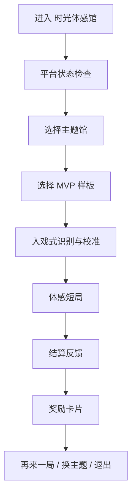

# MotionX Retro Pack / MVP 与系统模块分层方案

> 本文只负责定义 `MotionX Retro Pack / 时光体感馆` 的 MVP 系统分层、阶段优先级和跨端模块边界。产品定位、范围管理、里程碑、付费、奖励和《童年的一天》编排不在本文重复展开，统一引用对应权威文档。

## 1. 文档职责

| 本文负责 | 不在本文重复维护 |
| --- | --- |
| MVP、首发、成长期的系统模块分层 | 产品一句话、用户价值、主题馆完整介绍 |
| P0 / P1 / P2 模块优先级 | 项目范围、WBS、验收和变更控制 |
| 移动端优先与大屏端同源适配边界 | 具体里程碑排期和 Gate 评审细节 |
| 内容条目、主循环、端侧差异的系统约束 | 付费细则、奖励卡片清单、微信分享细节 |
| `童年的一天` 在模块层的预留方式 | 云端 playlist 结构和时间线体验文案 |

权威引用：

| 主题 | 权威文档 |
| --- | --- |
| 产品定位、目标用户、首批样板 | [MotionX-Retro-Pack-产品定义.md](../../项目管理计划/MotionX-Retro-Pack-产品定义.md) |
| 范围、WBS、验收、变更控制 | [MotionX-Retro-Pack-项目范围管理计划.md](../../项目管理计划/MotionX-Retro-Pack-项目范围管理计划.md) |
| 阶段计划和 Gate | [MotionX-Retro-Pack-里程碑计划.md](../../项目管理计划/MotionX-Retro-Pack-里程碑计划.md) |
| `童年的一天` 与主题馆关系 | [童年的一天_云端内容编排关系.md](../童年的一天_云端内容编排关系.md) |
| 付费模型和商业化红线 | [MotionX-Retro-Pack-付费设计方案.md](./MotionX-Retro-Pack-付费设计方案.md) |
| 奖励卡片与轻收集 | [MotionX-Retro-Pack-奖励卡片与轻收集设计.md](./MotionX-Retro-Pack-奖励卡片与轻收集设计.md) |
| 家长控制、内容限制和合规拦截 | [MotionX-Retro-Pack-家长控制与内容限制管理设计方案.md](./MotionX-Retro-Pack-家长控制与内容限制管理设计方案.md) |
| 活动、推广和长期运营 | [MotionX-Retro-Pack-推广与运营方案.md](../../项目管理计划/MotionX-Retro-Pack-推广与运营方案.md) |

## 2. 核心结论

`MotionX Retro Pack` 应按“家庭复古体感内容平台”搭建，而不是普通小游戏大厅或重养成系统。

当前执行顺序：

| 阶段 | 内容规模 | 核心目标 |
| --- | --- | --- |
| MVP | 3 个样板 | 先在手机 / 平板跑通入口、识别、短局、结算、奖励和埋点闭环 |
| 首发 | 6-10 个内容 | 扩成可销售、可宣传、可渠道演示的基础内容包 |
| 成长期 | 10-20 个内容 | 启用《童年的一天》云端编排、周期活动和 Game Pass |

当前稳定边界：

1. MVP 优先手机版 / 平板移动端，不按移动端和大屏端并行交付。
2. 手机和平板归为同一个移动端产品，只做响应式适配，不拆玩法和 UI 结构。
3. 大屏端保留同源产品包和后续适配路径，不抢占 MVP 资源。
4. 移动端和大屏端使用同一套游戏内容池、游戏 ID、核心规则、单局流程、奖励条件和数据口径。
5. 两端差异只放在 UI 布局、信息密度、输入方式、设备权限、分辨率和站位提示。
6. 国内联网发布时，账号实名、防沉迷、未成年人时段 / 时长、付费限制、隐私提示和合规拦截是平台门槛，不是后置运营插件。

## 3. MVP 核心闭环

MVP 只证明“手机版复古体感短局”是否成立，不等同完整上线版本。



MVP 固定验证三条样板线：

| 主题馆 | MVP 样板 | 主要动作原语 | 验证重点 |
| --- | --- | --- | --- |
| 童年操场 | 操场木头人 | `RunStop`、`FreezeStill` | 跑停、冻结、多人基础可读性 |
| 客厅街机 | 电玩城投篮机 | `ReachZone`、`ArmSwing` | 街机化爽感、刷分、再来一局 |
| 电视健美操 | 家庭电视健美操 | `KneeRaise`、`ArmSwing`、`SquatStand`、`ClapBeat` | 跟做节奏、亲子参与、轻健身入口 |

MVP 必须验证：

| 指标 | 用途 |
| --- | --- |
| 入口点击率 | 用户是否愿意进入 `时光体感馆` |
| 首局完成率 | 权限、识别、流程、难度是否阻断 |
| 再来一局比例 | 短局是否具备复玩吸引力 |
| 5 秒动作理解率 | 用户是否能快速知道要做什么动作 |
| 30 秒玩法理解率 | 用户是否能快速理解单局目标 |
| 结算理解度 | 用户是否理解分数、称号、回忆标签和奖励卡片 |
| 识别失败率 | 动作识别、站位、取景提示是否稳定 |
| 主动退出率 | 入口、权限、校准、玩法或结算是否存在卡点 |
| 合规拦截正确率 | 国内联网版本中，未实名、超时、非可玩时段和付费限制是否正确拦截 |

## 4. 系统模块分层

```text
MotionX Retro Pack
├─ P0 MVP 核心闭环
│  ├─ 移动端入口系统
│  │  ├─ 时光体感馆 / Time Play
│  │  ├─ 童年操场 / 客厅街机 / 电视健美操 三个最小主题馆
│  │  └─ 手机竖屏优先、平板响应式适配
│  ├─ 内容条目系统
│  │  ├─ 三个 MVP 样板内容
│  │  ├─ content_id、theme、motion_tags、players、duration、intensity、status
│  │  ├─ 可选 time_slots 弱标签
│  │  └─ 后续云端编排可引用的内容结构
│  ├─ 复古包装流程系统
│  │  ├─ 回忆开场
│  │  ├─ 入戏式识别
│  │  ├─ 核心玩法
│  │  ├─ 轻松反馈
│  │  └─ 结算界面
│  ├─ 体感识别与校准系统
│  │  ├─ 摄像头授权
│  │  ├─ 动作原语识别
│  │  ├─ 站位、取景和安全提示
│  │  └─ 识别失败、重试和超时处理
│  ├─ 单局流程系统
│  │  ├─ 准备、识别、倒计时、游戏、反馈、结算
│  │  ├─ 单局 1-3 分钟
│  │  └─ 暂停、退出、姿态丢失和异常中断
│  ├─ 基础多人系统
│  │  ├─ 轮流、分队或粗粒度同屏
│  │  └─ 不做精确家庭同步率、真实地面落点或前后纵深移动判定
│  ├─ 结算与轻奖励系统
│  │  ├─ 分数、称号、回忆标签
│  │  ├─ 静态奖励卡片模板
│  │  └─ 可保存的结算分享图
│  ├─ MVP 数据埋点系统
│  │  ├─ 入口点击、主题馆点击、游戏点击
│  │  ├─ 首局完成、复玩、主动退出、识别失败
│  │  └─ 合规拦截原因码
│  ├─ 移动端优先的双端架构系统
│  │  ├─ MVP 先做手机 / 平板
│  │  ├─ 大屏端保留同源适配路径
│  │  └─ 同一游戏 ID、同一规则、同一流程、同一奖励口径
│  └─ 平台合规与防沉迷系统
│     ├─ 账号登录、实名注册和登录态校验
│     ├─ 防沉迷实名验证接入预留
│     ├─ 未成年人时段、时长和付费限制
│     ├─ 摄像头、儿童隐私和数据最小化提示
│     └─ 合规拦截、提示文案和异常兜底
├─ P1 首发扩展模块
│  ├─ 内容扩展到 6-10 个
│  ├─ 内容池按主题馆、动作、强度、人数和时段标签筛选
│  ├─ 1-2 个轻量首发挑战
│  ├─ 街机类高分榜或本地榜
│  ├─ 独立奖励卡片与轻收集展示
│  ├─ 微信分享：结算卡片、挑战邀请、活动海报和二维码落地页
│  ├─ 商店主图、截图、15 秒短视频和渠道一页纸
│  └─ 按主题馆、样板、渠道拆分数据复盘
└─ P2 成长期运营模块
   ├─ Game Pass：每周家庭挑战、每月主题活动
   ├─ 节日活动：节日游园会、暑假运动会、春节游园
   ├─ 国内主题皮肤：中国童年操场、春节游园、西游童年神话
   ├─ 童年的一天云端编排入口
   ├─ playlist_id、时段、内容 ID、展示文案和运行参数下发
   ├─ 用户与家庭档案
   ├─ 账号、权益和奖励同步
   ├─ 微信生态运营：挑战邀请、节日转发、群内回流和分享归因
   └─ 付费与权益系统：主题包、Game Pass、OEM 定制内容
```

## 5. MVP 开启项与禁止项

MVP 版本只开启以下可交付项：

| 模块 | MVP 同步口径 |
| --- | --- |
| 主题入口 | `时光体感馆 / Time Play` 基础入口 |
| 主题馆 | `童年操场`、`客厅街机`、`电视健美操` 三个方向的最小呈现 |
| 样板内容 | 固定为 `操场木头人`、`电玩城投篮机`、`家庭电视健美操` |
| 内容条目 | 每个样板具备内容 ID、主题馆、动作标签、人数、时长、强度、状态和可选时段标签 |
| 包装流程 | 回忆开场、入戏式识别、核心玩法、轻松反馈、结算界面 |
| UI | 手机竖屏优先、平板响应式适配；大屏端只保留同源适配约束 |
| 音乐音效 | 一套原创复古音乐 demo 和基础音效 |
| 多人 | 轮流、分队或粗粒度同屏 |
| 结算奖励 | 分数、称号、回忆标签和静态奖励卡片模板 |
| 数据埋点 | 入口点击、游戏点击、首局完成、复玩、退出、识别失败 |
| 合规 | 国内联网发布时，完成账号、实名、防沉迷状态、未成年人限制和付费拦截的最小闭环 |
| 测试 | iOS / Android 手机和平板真实设备验证；Lite / RK3566 只保留基础识别和性能验证 |

MVP 禁止项：

1. 不做完整《童年的一天》时间线主入口。
2. 不做复杂任务系统、Game Pass、付费系统和深度 OEM 定制。
3. 不做实时合影、换装、完整西游剧情或大规模社交。
4. 不做复杂等级、装备、货币、体力、复活、抽卡或随机奖励。
5. 不把手机端做成电视遥控器或奖励册。
6. 不把大屏端完整 UI 和电视盒子渠道版本纳入当前 MVP。

## 6. 与《童年的一天》的模块关系

`童年的一天` 在本文中只作为 P2 云端编排路线预留，不作为第四个主题馆，也不复制独立内容库。详细编排结构以 [童年的一天_云端内容编排关系.md](../童年的一天_云端内容编排关系.md) 为准。

| 阶段 | 模块处理方式 |
| --- | --- |
| MVP | 主题馆入口 + 三个样板内容 + 弱时段标签 |
| 首发 | 主题馆内容扩展到 6-10 个，可出现弱推荐顺序或轻量挑战 |
| 成长期 | 内容达到 10-20 个后，启用《童年的一天》云端编排入口 |

模块红线：

1. 不把 `童年的一天` 做成第四个主题馆。
2. 不为 `童年的一天` 复制独立游戏目录。
3. 不让客户端写死固定时间线内容顺序。
4. 不在 MVP 阶段要求完整通关式时间线体验。

## 7. 双端产品边界

| 维度 | 移动端产品包 | 大屏端产品包 |
| --- | --- | --- |
| 覆盖设备 | 手机、平板 | 电视、电视盒子、大屏设备 |
| 当前优先级 | MVP 主交付 | 后续同源扩展 |
| 产品定位 | 随身短局复古体感产品 | 客厅家庭共玩产品 |
| 共用项 | 游戏 ID、核心规则、动作原语、单局流程、时长、评分、奖励、活动和数据口径 | 游戏 ID、核心规则、动作原语、单局流程、时长、评分、奖励、活动和数据口径 |
| 独立适配项 | 触控、权限、取景、竖屏浏览、横屏游戏 HUD、保存 / 分享 | 远距离 UI、遥控器 / 手势、站位、安全距离、围观可读性 |
| 不做项 | 不做电视遥控器或奖励册 | 不在 MVP 阶段抢占完整渠道包资源 |

手机和平板同属移动端产品：

| 约束项 | 手机 / 平板处理 |
| --- | --- |
| 产品归属 | 同一个移动端产品 |
| 核心一致性 | 同一套游戏、功能入口、UI 结构、单局流程、奖励体系、活动体系和付费权益 |
| 适配原则 | 只做响应式排版、尺寸、间距和 HUD 参数缩放 |
| 不做项 | 不单独设计平板专属系统，不把平板做成重展示模式 |

## 8. 模块优先级

| 优先级 | 必做模块 | 说明 |
| --- | --- | --- |
| P0 | 主题入口、三个主题馆最小呈现、三个 MVP 样板、内容条目、包装流程、单局流程、识别校准、基础多人、结算奖励、数据埋点、移动端 UI、平台合规 | 用于证明手机版 / 平板 MVP 是否成立 |
| P1 | 内容扩展、内容池筛选、轻量挑战、本地榜、轻收集图鉴、首发推广素材、微信分享、渠道数据复盘 | 用于形成可销售、可宣传的首发基础包 |
| P2 | Game Pass、周期活动、节日活动、主题皮肤包、《童年的一天》云端编排、家庭档案、双端账号权益同步、OEM 定制 | 用于长期运营和渠道复制 |

## 9. 粘性模块 authority

粘性能力不单独扩成重运营系统，按职责拆到现有 authority 中维护。

| 粘性能力 | 维护位置 | 当前阶段边界 |
| --- | --- | --- |
| 短局复玩、再来一局、换主题、继续挑战 | 本文 | P0 只验证结算后的明确下一步和复玩率 |
| 奖励触发、贴纸、徽章、称号、家庭奖励、收藏进度 | [奖励卡片与轻收集设计](./MotionX-Retro-Pack-奖励卡片与轻收集设计.md) | P0 只做轻奖励和静态奖励卡片；复杂图鉴后置 |
| 每日 / 周末家庭挑战、活动奖励、节日限定内容 | [推广与运营方案](../../项目管理计划/MotionX-Retro-Pack-推广与运营方案.md) | MVP 只预留结构；首发后再做轻量挑战 |
| Game Pass、订阅权益、新奖励合集、活动付费边界 | [付费设计方案](./MotionX-Retro-Pack-付费设计方案.md) | 只在内容更新节奏和留存数据成立后启用 |
| 结算卡片保存、微信分享、二维码、活动回流归因 | [微信分享模块设计文档](./MotionX-Retro-Pack-微信分享模块设计文档.md) | 分享是结果表达和回流入口，不作为领奖励前置条件 |

维护原则：

1. 不新增平行的“粘性总方案”去重复维护奖励、活动和付费规则。
2. 新增粘性能力时，先判断它是复玩路径、奖励规则、运营活动、付费权益还是分享回流，再改对应 authority。
3. MVP 阶段不把粘性做成复杂任务链、签到、体力、货币、装备、抽卡或强制分享。

## 10. 维护规则

为避免文档重复和口径漂移，后续按以下规则维护：

1. 产品定位变化，改 [产品定义](../../项目管理计划/MotionX-Retro-Pack-产品定义.md)，本文只同步模块影响。
2. MVP 范围、WBS、验收或变更机制变化，改 [项目范围管理计划](../../项目管理计划/MotionX-Retro-Pack-项目范围管理计划.md)，本文只同步系统分层。
3. 阶段节奏、Gate、内容数量阈值变化，改 [里程碑计划](../../项目管理计划/MotionX-Retro-Pack-里程碑计划.md)，本文只同步 P0 / P1 / P2 边界。
4. `童年的一天` 编排、playlist、time_slots 变化，改 [童年的一天_云端内容编排关系](../童年的一天_云端内容编排关系.md)，本文只保留阶段关系和红线。
5. 商业化变化，改 [付费设计方案](./MotionX-Retro-Pack-付费设计方案.md)，本文只保留“不把奖励、体力、复活、抽卡做成 MVP 付费点”的边界。
6. 奖励清单变化，改 [奖励卡片与轻收集设计](./MotionX-Retro-Pack-奖励卡片与轻收集设计.md)，本文只保留结算与轻奖励系统入口。
7. 家长控制、内容限制、实名、防沉迷、未成年人限制和隐私提示变化，改 [家长控制与内容限制管理设计方案](./MotionX-Retro-Pack-家长控制与内容限制管理设计方案.md)，本文只保留 P0 平台门槛。
8. 活动、挑战、推广素材、渠道话术或 Game Pass 运营节奏变化，改 [推广与运营方案](../../项目管理计划/MotionX-Retro-Pack-推广与运营方案.md)，本文只保留 P1 / P2 模块归位。

## 11. 结论

`MotionX Retro Pack` 的系统分层应按“同一批短局体感游戏 + 移动端优先闭环 + 大屏端同源适配 + 轻收集 + 周期活动 + 云端编排”搭建。

当前最重要的是先在手机 / 平板上证明三个样板、复古包装流程、动作识别、结算奖励、基础埋点和合规门禁成立。首发再扩到 6-10 个内容；内容达到 10-20 个后，再把《童年的一天》升级为云端下发的编排路线，而不是第四个主题馆或客户端写死的时间线。
