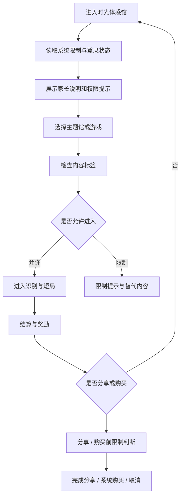

# MotionX Retro Pack / 家长控制与内容限制管理设计方案

> 本文定义 `MotionX Retro Pack / 时光体感馆` 可通过家长控制和内容限制管理的产品设计方案。该能力不是单独的玩法系统，而是覆盖内容分级、未成年人保护、付费限制、分享限制、隐私提示和平台审核材料的合规型基础能力。

## 1. 文档职责

| 本文负责 | 不在本文重复维护 |
| --- | --- |
| 家长控制、内容限制、儿童保护和平台限制的产品边界 | 具体法律条文解释和最终法务意见 |
| MVP、首发、成长期的能力分层 | 付费价格、订阅权益和活动运营细则 |
| 内容分级、分享、付费、时长和隐私的控制策略 | 每个游戏的动作识别算法和玩法规则 |
| 渠道审核材料需要表达的功能口径 | App Store、安卓渠道、微信生态的最终上架表单填写 |

权威引用：

| 主题 | 权威文档 |
| --- | --- |
| 产品定位与目标用户 | [MotionX-Retro-Pack-产品定义.md](../../项目管理计划/MotionX-Retro-Pack-产品定义.md) |
| MVP 模块与平台合规边界 | [MotionX-Retro-Pack-MVP与系统模块分层方案.md](./MotionX-Retro-Pack-MVP与系统模块分层方案.md) |
| 付费模型与儿童付费红线 | [MotionX-Retro-Pack-付费设计方案.md](./MotionX-Retro-Pack-付费设计方案.md) |
| 微信分享与隐私边界 | [MotionX-Retro-Pack-微信分享模块设计文档.md](./MotionX-Retro-Pack-微信分享模块设计文档.md) |
| 奖励卡片与轻收集 | [MotionX-Retro-Pack-奖励卡片与轻收集设计.md](./MotionX-Retro-Pack-奖励卡片与轻收集设计.md) |
| 风险登记 | [MotionX-Retro-Pack-风险登记册.md](../../项目管理计划/MotionX-Retro-Pack-风险登记册.md) |

## 2. 核心结论

`MotionX Retro Pack` 应明确支持“可通过家长控制和内容限制管理”的产品口径，但不能只依赖系统设置。系统级限制负责设备和商店侧拦截，产品内控制负责家庭场景下的内容、付费、分享和隐私保护。

当前设计结论：

| 层级 | 责任 | MotionX 处理方式 |
| --- | --- | --- |
| 系统级家长控制 | 由 iOS、Android、应用商店、设备厂商或渠道提供 | 尊重系统限制、年龄分级、购买限制、屏幕时间和内容限制 |
| 平台实名 / 防沉迷 | 国内联网版本需要接入或预留 | 登录、实名、时段、时长、付费限制和合规拦截进入 P0 边界 |
| 产品内家长控制 | 产品自己提供清晰的家庭保护能力 | 控制内容范围、分享、付费入口、摄像头权限、数据和提示文案 |
| 内容运营限制 | 内容池和活动配置必须可控 | 每个内容具备年龄、强度、人数、分享、付费和联网标签 |

一句话口径：

> MotionX Retro Pack 可以被系统家长控制和内容限制管理，同时产品内也要提供更保守的家庭保护边界：儿童奖励不收费、分享不暴露敏感信息、摄像头数据最小化、未成年人时段和付费限制前置拦截。

## 3. 设计目标

家长控制与内容限制管理要解决四个问题：

1. 家长知道这个产品适合家庭和儿童一起玩。
2. 平台和渠道能理解产品内容、权限、付费和分享边界。
3. 未成年人用户不会被引导到不合适的内容、付费、社交或数据分享。
4. 产品团队在扩展主题包、活动和 Game Pass 时有稳定的内容治理规则。

该能力不是为了增加设置复杂度，而是为了减少家庭用户的不信任感和渠道审核风险。

## 4. 控制对象

| 控制对象 | 需要控制的原因 | 默认策略 |
| --- | --- | --- |
| 内容主题 | 避免出现不适合儿童的暴力、恐怖、成人、赌博或真实 IP 风险 | 全部内容按家庭友好标准设计 |
| 运动强度 | 儿童、家长、老人同玩时体能差异明显 | 标注轻度 / 中度 / 高强度，默认推荐轻中度 |
| 游戏时长 | 体感游戏容易连续复玩 | 单局 1-3 分钟，提供休息提示 |
| 付费入口 | 儿童内购敏感，影响家庭信任和审核 | MVP 不开放付费；首发只卖清晰内容包；儿童奖励不收费 |
| 分享入口 | 结算图、活动海报可能涉及儿童信息 | 默认只分享抽象成绩、称号和主题视觉 |
| 摄像头权限 | 体感识别依赖摄像头，家庭用户敏感 | 明确用途、最小采集、默认不上传原始画面 |
| 联网活动 | 活动、榜单、分享、订阅可能触发合规要求 | 未成年人状态、实名状态和内容限制先判断再进入 |
| 奖励系统 | 奖励容易被做成消费或攀比刺激 | 贴纸、徽章、称号、奖励卡片只通过游玩解锁 |

## 5. 用户与权限模型

产品内不需要在 MVP 阶段做复杂家庭账号，但要预留清晰的权限模型。

| 角色 | 能做什么 | 不能做什么 |
| --- | --- | --- |
| 家长 / 监护人 | 开启内容限制、管理付费入口、允许分享、查看隐私说明、关闭活动推送 | 不需要理解复杂后台或开发者配置 |
| 儿童玩家 | 选择可玩内容、完成短局、获得奖励卡片、再来一局 | 不直接购买、不绕过时长限制、不发布敏感分享 |
| 普通家庭成员 | 参与本地同屏或轮流游戏、查看结算 | 不管理付费、隐私和内容限制 |
| 运营 / 内容配置 | 给内容打标签、控制活动可见范围、关闭高风险内容 | 不绕过合规限制向未成年人下发不适合内容 |

首版可以不做独立“家长后台”，但需要有 `家长说明`、`隐私说明`、`内容限制说明` 和必要的开关占位。

## 6. 内容分级与标签

每个游戏内容、活动和主题包都需要具备可管理标签。标签用于入口筛选、家长控制、活动下发、审核说明和数据复盘。

| 字段 | 示例 | 用途 |
| --- | --- | --- |
| `content_id` | `playground_red_light` | 内容唯一标识 |
| `age_hint` | `4+`、`6+`、`8+` | 年龄建议，不等同最终商店分级 |
| `intensity` | `low`、`medium`、`high` | 运动强度提示 |
| `players` | `single`、`family`、`team` | 参与人数和家庭共玩判断 |
| `camera_required` | `true` / `false` | 是否需要摄像头权限 |
| `network_required` | `true` / `false` | 是否依赖联网活动或榜单 |
| `share_enabled` | `true` / `false` | 是否允许生成分享图或活动海报 |
| `purchase_related` | `none`、`paid_pack`、`game_pass` | 是否关联内容包或订阅 |
| `minor_allowed` | `true` / `false` | 未成年人是否可进入 |
| `parent_gate_required` | `true` / `false` | 是否需要家长确认 |

内容池示例：

| 内容 | 年龄建议 | 强度 | 摄像头 | 分享 | 付费关系 | 默认限制 |
| --- | --- | --- | --- | --- | --- | --- |
| 操场木头人 | 4+ | 低 / 中 | 需要 | 可分享结算卡 | MVP 免费样板 | 可玩 |
| 电玩城投篮机 | 6+ | 中 | 需要 | 可分享成绩卡 | MVP 免费样板 | 可玩 |
| 家庭电视健美操 | 4+ | 低 / 中 | 需要 | 可保存奖励卡 | MVP 免费样板 | 可玩 |
| 节日家庭挑战 | 6+ | 中 | 需要 | 可分享活动海报 | Game Pass 活动 | 未实名 / 超时不可进入 |
| 高强度限时挑战 | 8+ | 高 | 需要 | 可分享成绩 | 活动内容 | 默认不推荐低龄儿童 |

## 7. 产品内家长控制

产品内家长控制采用“少开关、强默认、关键处确认”的方式，不做复杂系统设置复制。

| 功能 | MVP | 首发 | 成长期 |
| --- | --- | --- | --- |
| 家长说明页 | 必须 | 必须 | 必须 |
| 内容适龄和强度提示 | 必须 | 必须 | 必须 |
| 摄像头用途说明 | 必须 | 必须 | 必须 |
| 分享敏感信息保护 | 必须 | 必须 | 必须 |
| 儿童付费拦截 | 预留 / 国内联网版本必须 | 必须 | 必须 |
| 游玩时长和休息提示 | 基础提示 | 可配置提醒 | 家庭规则配置 |
| 内容隐藏 / 仅显示适龄内容 | 预留 | 可做 | 应做 |
| 家长 PIN / 家长确认 | 预留 | 付费和外链可用 | 可用于设置变更 |
| 活动与 Game Pass 限制 | 不开放 | 付费入口限制 | 活动下发限制 |

推荐设置项：

| 设置项 | 默认值 | 说明 |
| --- | --- | --- |
| 只显示适龄内容 | 开启 | 默认隐藏高强度或不适合低龄儿童的内容 |
| 分享前确认 | 开启 | 分享卡片、活动海报、二维码都需要用户主动触发 |
| 不分享摄像头画面 | 开启 | MVP 和首发默认不分享原始摄像头画面 |
| 儿童奖励不可购买 | 固定开启 | 贴纸、徽章、称号、奖励卡片不能付费购买 |
| 连续游玩休息提醒 | 开启 | 连续多局后提醒休息，不强制羞辱式中断 |
| 外部链接家长确认 | 开启 | 隐私政策、活动页、购买页等外链前做确认 |

## 8. 系统级家长控制适配

系统级家长控制由操作系统、应用商店和设备厂商实现。产品需要做的是尊重系统状态，并在审核材料中准确说明。

| 系统能力 | 产品适配要求 |
| --- | --- |
| 年龄分级 / 内容评级 | 按真实内容填写，不用低报分级换流量 |
| 内容限制 | 不在受限环境中展示不合适内容、活动或外链 |
| 屏幕时间 / 使用时长 | 尊重系统限制，不设计绕过提示 |
| 购买限制 | 内购、订阅、付费包必须走系统购买确认和家长授权流程 |
| 摄像头权限 | 未授权时给出清晰替代提示，不诱导用户反复授权 |
| 通知限制 | 不通过通知诱导未成年人频繁回流、消费或分享 |

产品文案不要承诺“完全替代系统家长控制”。正确表达是：

> 本产品支持系统家长控制和内容限制，并在产品内提供内容适龄提示、付费边界、分享保护和隐私说明。

## 9. 付费限制

付费限制以 [付费设计方案](./MotionX-Retro-Pack-付费设计方案.md) 为准，本文只补充家长控制口径。

| 项目 | 家长控制策略 |
| --- | --- |
| MVP | 不开放付费入口 |
| 首发基础包 | 作为完整内容包销售，购买需走系统确认 |
| Game Pass | 成长期再开放，未成年人限制和家长确认前置 |
| 贴纸 / 徽章 / 称号 | 不收费 |
| 奖励卡片 | 不收费 |
| 复活 / 体力 / 加分 | 不做 |
| 抽卡 / 盲盒 / 随机奖励 | 不做 |

付费入口必须满足：

1. 未成年人状态先判断，再展示购买入口。
2. 系统购买限制优先级高于产品内提示。
3. 付费页不使用儿童压力文案，例如“马上买，不然奖励消失”。
4. 付费权益面向家长讲清楚是内容包、活动服务或订阅，不包装成儿童奖励。

## 10. 分享与隐私限制

分享限制以 [微信分享模块设计文档](./MotionX-Retro-Pack-微信分享模块设计文档.md) 为准，本文只补充家长控制口径。

可分享：

- 游戏名。
- 分数。
- 称号。
- 回忆标签。
- 主题视觉。
- 活动名。
- 二维码或落地页。

默认不分享：

- 儿童真实姓名。
- 精确位置。
- 摄像头原始画面。
- 家庭成员关系。
- 设备唯一标识。
- 联系人、通讯录或社交关系链。
- 可识别的家庭住址、学校、班级等敏感信息。

分享入口必须满足：

1. 分享由用户主动触发，不作为领奖励或解锁玩法的前置条件。
2. 未成年人分享内容默认只使用抽象成绩和主题视觉。
3. 实时合影、相册、视频回放上线前必须单独做隐私复核。
4. 分享回流进入游戏、活动或付费页时仍需经过实名、防沉迷和付费限制判断。

## 11. 体验流程

限制提示原则：

| 场景 | 推荐提示方向 |
| --- | --- |
| 摄像头未授权 | 说明体感识别需要摄像头，可返回选择其他内容或去系统设置 |
| 内容不适合当前限制 | 提供适龄内容推荐，不责备儿童 |
| 已达到休息提醒条件 | 提醒喝水、休息、稍后再玩 |
| 付费受限 | 提示需要家长确认或系统购买授权 |
| 分享受限 | 提示当前只能保存本地或关闭分享 |

## 12. 埋点与审计

埋点只记录产品判断和体验优化所需字段，不采集多余儿童个人信息。

| 事件 | 触发时机 | 字段 |
| --- | --- | --- |
| `parent_notice_viewed` | 家长说明被查看 | `source`、`version` |
| `content_limit_checked` | 进入内容前完成限制判断 | `content_id`、`age_hint`、`result`、`reason_code` |
| `minor_gate_blocked` | 未成年人限制拦截 | `scene`、`reason_code` |
| `camera_permission_prompted` | 摄像头权限提示 | `scene`、`result` |
| `rest_reminder_shown` | 休息提醒展示 | `session_count`、`duration_bucket` |
| `purchase_gate_checked` | 付费入口限制判断 | `product_type`、`result`、`reason_code` |
| `share_gate_checked` | 分享入口限制判断 | `share_type`、`result`、`reason_code` |

原因码建议：

| 原因码 | 含义 |
| --- | --- |
| `system_restricted` | 系统家长控制或内容限制拦截 |
| `minor_time_limit` | 未成年人时段或时长限制 |
| `purchase_restricted` | 系统购买或产品付费限制 |
| `share_restricted` | 分享被关闭或当前内容不可分享 |
| `camera_denied` | 摄像头权限未授权 |
| `age_not_allowed` | 内容标签不适合当前用户状态 |
| `network_required` | 当前内容需要联网或实名状态 |

## 13. 阶段方案

| 阶段 | 必做 | 不做 |
| --- | --- | --- |
| MVP | 家长说明、摄像头说明、内容强度提示、分享隐私边界、合规拦截埋点预留、国内联网版本实名 / 防沉迷最小闭环 | 家庭账号后台、复杂 PIN、Game Pass、付费入口、实时合影分享 |
| 首发 | 内容标签完整化、系统购买限制适配、基础内容隐藏、分享前确认、付费入口家长确认、渠道审核材料 | 抽卡、儿童奖励付费、绕过系统购买限制 |
| 成长期 | 家庭规则配置、活动内容下发限制、Game Pass 未成年人限制、家长 PIN、内容运营审计 | 将分享、付费、拉新做成儿童任务 |

## 14. 验收标准

| 模块 | 验收标准 |
| --- | --- |
| 家长说明 | 首次进入或设置页能看到产品适龄、摄像头、分享、付费和隐私说明 |
| 内容标签 | MVP 样板至少具备 `age_hint`、`intensity`、`camera_required`、`share_enabled`、`purchase_related` |
| 内容限制 | 不符合限制条件时不进入游戏，且给出替代内容或返回路径 |
| 摄像头权限 | 拒绝授权后不崩溃，不重复强压授权 |
| 付费限制 | MVP 无付费入口；首发购买必须走系统确认和限制判断 |
| 分享限制 | 分享图不包含真实姓名、位置、摄像头原始画面和敏感家庭信息 |
| 埋点 | 能区分允许、拦截、取消、权限拒绝和系统限制 |
| 审核材料 | 能向渠道说明产品支持家长控制、内容限制、儿童隐私保护和付费边界 |

## 15. 风险与处理

| 风险 | 表现 | 处理方式 |
| --- | --- | --- |
| 只依赖系统家长控制 | 产品内仍出现不适合儿童的分享、付费或活动入口 | 产品内增加内容标签和限制判断 |
| 过度设置复杂化 | 家长不知道怎么配置，儿童体验被设置页打断 | 默认保守，少量关键开关 |
| 付费文案刺激儿童 | 儿童向家长索要购买，形成投诉风险 | 付费面向家长讲内容包价值，不卖儿童奖励 |
| 分享泄露隐私 | 结算图出现真实姓名、画面或位置 | 默认只分享抽象成绩和主题视觉 |
| 活动运营越界 | Game Pass 活动绕过未成年人限制 | 活动下发前做内容标签和限制判断 |
| 合规口径不一致 | 产品、商店材料、隐私说明说法冲突 | 上架前由产品、法务、渠道统一复核 |

## 16. 当前执行口径

当前阶段优先做：

1. 把家长控制和内容限制作为 P0 合规基础能力，不作为后置运营插件。
2. MVP 三个样板补齐内容标签、摄像头说明、分享限制和埋点字段。
3. MVP 不开放付费，不做儿童奖励付费，不做实时合影分享。
4. 国内联网版本必须预留实名、防沉迷、未成年人时段 / 时长和付费限制判断。
5. 首发再补内容隐藏、系统购买限制适配、家长确认和渠道审核材料。

暂不做：

- 复杂家庭账号后台。
- 儿童内购。
- 分享领奖励。
- 拉人解锁玩法。
- 抽卡、盲盒或随机奖励。
- 实时摄像头画面分享。
- 绕过系统家长控制或购买限制的产品内通道。

