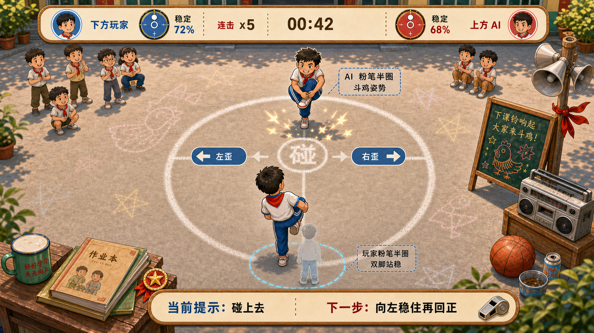

# MotionX Retro Pack / 斗鸡游戏 GDD

> 本文是 `MotionX Retro Pack / 时光体感馆` 中「斗鸡」玩法的单独 GDD。它把传统童年游戏「斗鸡」中“抱起一只脚顶对方、谁先失衡谁输”的记忆，改编成适合家庭客厅的安全短局体感游戏：玩家默认双脚站立控制平衡，短暂抬膝 / 抱脚触发屏幕角色斗鸡进攻，碰撞后再用双脚站立下的左右重心移动、短暂停稳和节奏回正来维持角色平衡。单局目标是让家庭用户在 45-75 秒内看懂“站稳、抬膝碰上去、放脚回中稳住”，并愿意再挑战一局。

## 游戏概述



「斗鸡」是一款以课间操场和粉笔圈为主题的短局体感玩法。玩家站在屏幕前的安全站位区，默认双脚站稳进入防守 / 平衡状态。当系统提示“碰上去”时，玩家短暂抬膝或抱起一只脚触发屏幕角色向对手顶上去；碰撞发生后，玩家可以放下脚回到双脚站立，通过身体左右重心移动、保持平衡和按节奏回正，让角色不歪、不退、不倒。

这个玩法不是让真实玩家互相冲撞，而是把真实斗鸡拆成五个适合 2D 单目识别的动作点：`双脚站稳`、`短暂抬膝 / 抱脚触发`、`左右重心修正`、`碰撞后回正`、`保持平衡`。屏幕表现采用 2.5D 斜俯视操场视角：镜头从上方斜看场地，既能看清地面粉笔圈和站位关系，也能看到角色正面、身体姿态和道具立面；玩家角色在画面下方，对手角色在画面上方，中间是粉笔圈碰撞区。碰撞沿上下轴发生，但触发来自玩家短暂抬膝 / 抱脚动作；左右只表示角色被撞歪后的平衡方向和玩家真实重心移动方向，不表示顶撞路线。碰撞只发生在游戏角色之间，玩家之间不需要真实接触，也不鼓励儿童互相靠近或冲撞。

单人首发模式强调“对抗 AI 挑战者”：系统控制上方 AI 角色靠近、试探、蓄力或后撤；当进入可触发窗口时，下方玩家需要保持双脚站稳，并短暂抬膝 / 抱脚触发进攻，屏幕角色才会顶上去发生碰撞。碰撞后角色会向左或向右歪，玩家放下脚回到双脚站立，根据歪斜方向用真实身体左右重心移动来拉回平衡，并及时回正稳住。如果触发动作无效、身体晃动过大、回正失败或平衡修正方向错误，屏幕角色会被撞退并损失平衡值。双人模式可以作为 P1 扩展，两名玩家在屏幕中呈上下关系控制各自角色的触发和碰撞后平衡，真实玩家仍然不发生身体接触。

整体体验要像课间小擂台，而不是格斗游戏。画面重点放在粉笔圈、同学围观、广播口哨、平衡条、角色碰撞、被顶退和胜利称号上；失败只表现为“没碰上”“退一格”“角色没站稳”，不表现疼痛、攻击或羞辱。

## 1. 游戏定位

| 项目 | 定义 |
| --- | --- |
| 游戏名 | 斗鸡 |
| 童年原型 | 斗鸡 / 单脚斗鸡 |
| 内容线 | 童年操场 / 课间空地 |
| 推荐端 | 大屏端优先，移动端可做横屏适配 |
| 推荐人数 | 1 人首发；P1 扩展 2 人屏幕上下对阵；长期可做亲子轮流挑战 |
| 单局时长 | 45-75 秒 |
| 核心体验 | 双脚站稳控制平衡，在可触发窗口短暂抬膝 / 抱脚让屏幕角色顶上去，碰撞后根据角色歪斜方向左右移动重心并及时回正，避免角色被顶出粉笔圈 |
| 目标用户 | 亲子家庭、儿童、80/90 后父母、派对轮流挑战用户 |
| 设计关键词 | 课间斗鸡、双脚平衡、抬膝进攻、角色碰撞、粉笔圈擂台、安全对抗、轻松围观 |

斗鸡的核心不是“真人撞赢别人”，也不是“全程单脚站很久”，而是“用抬膝 / 抱脚保留斗鸡记忆，用双脚重心控制把屏幕角色稳住”。它适合放在 `童年操场` 主题馆中，作为一个动作差异明显的平衡对抗内容，和 `丢沙包` 的躲闪、`木头人` 的跑停、`跳房子` 的脚步路线形成互补。

## 2. 设计目标

| 目标 | 设计要求 |
| --- | --- |
| 5 秒内看懂 | 2.5D 斜俯视画面中有粉笔圈、上下对阵角色、碰撞区、左右平衡提示和平衡条，用户一眼知道要“站稳、抬膝碰上去、回中稳住” |
| 30 秒内学会 | 只需要学会双脚站稳、抬膝触发、左移重心、右移重心、回正五类动作 |
| 安全改造清楚 | 所有碰撞都发生在屏幕角色之间，真实玩家只在各自站位区控制角色 |
| 动作原语收敛 | 只使用双脚站稳、短暂抬膝 / 抱脚、身体左右重心移动、静止稳定、轻微回正，不做真实接触、前后冲撞和精确地面落点 |
| 失败可接受 | 触发失败或方向错误只扣平衡值、退一格或断连击，不做疼痛和嘲笑表现 |
| 围观可读 | 平衡条、角色站位、碰撞结果、粉笔圈边界和回合胜负必须远距离清楚 |
| 家庭可玩 | 单人先对 AI，双人模式也分区站位，避免儿童在客厅互相撞 |
| 复古感不靠旧滤镜 | 用操场、粉笔线、广播喇叭、课间围观、红领巾色块和小奖状表达童年记忆 |

## 3. 游戏 DNA 卡片

| 项目 | 设计 |
| --- | --- |
| 游戏名 | 斗鸡 |
| 所属主题馆 | 童年操场 |
| 场景一句话 | 下课后的操场空地，同学们用粉笔画出小擂台，比谁碰上去后更稳 |
| 玩家身份 | 站进粉笔圈的课间挑战者 |
| 动作理由 | 双脚站稳守住粉笔圈，短暂抬膝 / 抱脚触发斗鸡进攻，碰撞后用左右重心移动修正歪斜并回正 |
| 核心动作原语 | `StableTwoFootBalance` + `KneeLiftAttackTrigger` + `LeanLeftRight` + `TimingReturn` |
| 记忆触发音 | 下课铃 + 口哨 + 操场广播 + 粉笔划线声 |
| 关键视觉锚点 | 2.5D 斜俯视粉笔圆圈擂台 + 上下对阵角色 + 中央碰撞区 + 左右平衡提示 + 碰撞尘点 + 双方平衡条 |
| 反馈语言 | “站稳一点”“碰上了”“稳住了”“别歪了”“退一格再来” |
| 结算记忆 | 称号：课间站稳王；标签：粉笔圈里的斗鸡挑战 |

## 4. 核心玩法概述

| 核心环节 | 规格 |
| --- | --- |
| 玩家位置 | 真实玩家站在屏幕前安全站位区；屏幕角色采用上下对阵，玩家角色默认在下方，对手角色在上方 |
| 入场条件 | 双脚站进安全站位区，身体中心稳定 1 秒以上 |
| 系统预告 | 上方对手角色出现靠近、蓄力、顶撞、守中或连续施压的动作预兆 |
| 碰撞触发 | 玩家保持双脚稳定并进入可触发窗口后，短暂抬膝 / 抱脚让屏幕角色向中间顶上去 |
| 玩家出招 | 抬起一只脚或抱膝 0.3-0.8 秒触发角色碰撞；不要求真实前冲、跳步或位移 |
| 玩家防守 | 碰撞后放下脚回到双脚站立，及时回正，避免重心过度偏移导致角色被撞退 |
| 判定输入 | 双脚站位稳定、抬膝高度、抬膝持续时间、肩髋中心偏移、身体晃动幅度、反向修正匹配度、回正时机 |
| 结果表现 | 两名角色肩侧 / 膝侧发生卡通碰撞，粉笔尘飞起，被顶退的一方扣平衡值，围观同学叫好 |

核心循环：

```text
站进粉笔圈
→ 双脚站稳进入防守状态
→ 看对手角色动作预兆
→ 保持站稳进入可触发窗口
→ 短暂抬膝 / 抱脚触发进攻
→ 屏幕角色顶撞 / 防守
→ 放下脚回到双脚站立
→ 根据角色歪斜左移 / 右移重心 / 守中
→ 碰撞后回正保持平衡
→ 根据碰撞结果和姿态稳定度扣平衡值
→ 回合胜负 / 下一波方向
```

### 4.1 改造逻辑

| 传统斗鸡元素 | 体感改造方式 | 保留的爽点 | 去掉的风险 |
| --- | --- | --- | --- |
| 单脚抱腿 | 短暂抬膝 / 抱脚触发进攻，不要求全程单脚站立 | 摆出童年姿势 | 不检测手指和真实抱腿细节 |
| 身体碰撞 | 玩家用安全姿势触发屏幕角色发生卡通化碰撞，碰撞后负责稳住 | 顶住、撞退、谁先退 | 真实玩家不发生接触 |
| 谁先失衡 | 平衡值扣分或回合失败 | 失衡即输的直观规则 | 不要求玩家真的摔倒或长时间单脚支撑 |
| 小伙伴围观 | 屏幕里同学和家长围观 | 课间热闹感 | 不让真实玩家围得太近 |
| 擂台边界 | 粉笔圈 / 安全站位区 | 被推出圈的紧张感 | 不判真实地面精确落点 |

这个玩法的本质是：

```text
传统斗鸡：人撞人，谁失衡谁输
斗鸡：屏幕角色相撞，玩家用真实姿态把角色稳住
```

### 4.2 场地关系

```text
+----------------------------------------------------------------------------+
|  2.5D 斜俯视操场：教学楼边缘 / 操场广播 / 围观同学 / 暖日光                  |
|                                                                            |
|   上方 AI 平衡 █████░░░                                                       |
|                                                                            |
|                         +----------------------+                             |
|                         |      AI / 对手角色    |                             |
|                         |        斗鸡姿势       |                             |
|                         +----------+-----------+                             |
|                                    |                                         |
|                         左歪修正  <>  右歪修正                               |
|                                    |                                         |
|                         +----------+-----------+                             |
|                         |        玩家角色       |                             |
|                         |        双脚站稳       |                             |
|                         +----------------------+                             |
|                                                                            |
|   下方玩家平衡 ███████░░                                                     |
|----------------------------------------------------------------------------|
|  底部动作提示：双脚站稳 / 抬膝碰上 / 左右稳住 / 回正别晃                    |
+----------------------------------------------------------------------------+
```

| 场地规则 | 说明 |
| --- | --- |
| 安全站位 | 玩家只在自己的站位区内做动作，不需要靠近另一名玩家 |
| 擂台边界 | 粉笔圈是视觉边界，真实判定用身体中心偏移和稳定度，不判真实脚踩线 |
| 视角关系 | 屏幕采用 2.5D 斜俯视视角，不是正上方纯俯视；玩家角色在画面下方、对手角色在画面上方；左右只用于平衡修正，与玩家真实左右重心移动保持一致 |
| 画面可读性 | 需要同时看清地面粉笔圈、角色正面姿态、身体歪斜方向和碰撞尘点；角色和课间道具允许有立面，不做纯平面棋盘视角 |
| 对抗中心 | 屏幕中间是角色碰撞区，表达“顶”“撞”“退”，不是玩家身体接触线 |
| 双人边界 | 双人模式在屏幕中上下对阵；真实站位仍按摄像头识别要求分区，UI 提醒分区站位和保持距离 |
| 摄像头边界 | 正面单目识别优先，不把侧身冲撞和前后位移作为必要动作 |

## 5. 单局流程

```text
回忆开场 8-12 秒
→ 入戏式识别 5-10 秒
→ 双脚站位确认
→ 基础教学 10 秒内
→ 游戏中 45-75 秒
→ 结算界面 10-20 秒
→ 奖励卡片 / 再来一局
```

### 5.1 回忆开场

| 项目 | 内容 |
| --- | --- |
| 画面起点 | 下课铃响起，操场一角被粉笔画出一个圆圈 |
| 场景物件 | 粉笔、队旗、广播喇叭、书包、搪瓷杯、围观同学、干净操场地面 |
| 入戏动作 | 虚拟粉笔线快速画出上下半圈，两个斗鸡角色从画面上方和下方跳进粉笔圈，下方角色先双脚站稳 |
| 可用短句 1 | “下课了，粉笔圈开擂。” |
| 可用短句 2 | “双脚站稳，准备碰上去。” |
| 可用短句 3 | “抬一下膝盖，碰上了就放下稳住。” |
| 文案边界 | 不说“撞过去”“打倒他”“踢人”“格斗”等攻击性词语 |

### 5.2 入戏式识别

| 项目 | 内容 |
| --- | --- |
| 包装方式 | 识别阶段包装成“站进粉笔圈”，不使用“校准”“骨骼识别”等技术词 |
| 推荐话术 1 | “站到粉笔圈里。” |
| 推荐话术 2 | “先双脚站稳。” |
| 推荐话术 3 | “提示来了就抬一下膝盖，碰到后放下脚稳住。” |
| 成功反馈 | 粉笔圈亮起，平衡条充满一格，广播口哨响 |
| 失败反馈 | “先站稳，没碰上也没关系。” |
| 识别兜底 | 如果抱脚识别不稳定，只判断抬膝高度和身体中心稳定；儿童模式允许更低抬膝高度 |

## 6. 操作与动作判定

| 动作 | 玩家行为 | 游戏含义 | 2D 姿势识别判定原则 |
| --- | --- | --- | --- |
| 双脚站稳 | 两脚着地，身体中心保持在安全范围内 | 入场、防守、碰撞后平衡基础 | 头肩髋中心稳定，双脚关键点在识别区内，持续达到阈值 |
| 抬膝 / 抱脚 | 短暂抬起一只膝盖，或自然抱起一只脚 | 触发斗鸡进攻 | 一侧膝盖高度超过阈值，持续 0.3-0.8 秒；不要求长时间单脚支撑 |
| 左移重心 | 双脚站立时身体中心向左轻移 | 当角色碰撞后向右歪时，用左移重心反向修正 | 肩中心、髋中心相对初始中心向左移动，幅度在安全阈值内 |
| 右移重心 | 双脚站立时身体中心向右轻移 | 当角色碰撞后向左歪时，用右移重心反向修正 | 肩中心、髋中心相对初始中心向右移动，幅度在安全阈值内 |
| 回正 | 重心移动或碰撞后回到中心 | 让角色从踉跄中稳住，恢复平衡 | 中心点回到初始范围内，晃动速度下降 |
| 守中 | 保持身体基本不晃 | 角色扎稳脚跟，等待对手顶撞或下一波 | 头肩髋关键点在短窗口内移动幅度低于阈值 |
| 失衡 | 身体晃动过大、偏离安全区、回正失败 | 角色被撞退、扣平衡值或回合失败 | 中心偏移过大、关键点速度异常、回正超时，持续超过宽容窗口 |

| 判定原则 | 说明 |
| --- | --- |
| 宽容优先 | 家庭用户动作不标准时，只降低评分，不频繁判失败 |
| 不判真实接触 | 不检测两人身体是否相撞，不鼓励靠近 |
| 不判精确脚位 | 不用真实地面坐标判断踩线，只用身体中心偏移模拟“被推出圈” |
| 不判精细抱膝 | 手是否真的抱住膝盖只做表现加分，不作为必要条件 |
| 不鼓励大幅跳动 | 大幅跳跃或冲出画面不加分，提示“站稳一点” |
| 儿童安全 | 引导“轻轻倾斜”，屏幕角色可以夸张顶撞，但真人不要求猛冲、猛顶或快速扭转膝盖 |

## 7. 碰撞触发机制

碰撞不是自动发生，也不是由玩家真实前冲、跳步或左右撞击触发，而是在“双脚站位稳定 + 可触发窗口打开”的条件下，由玩家短暂抬膝 / 抱脚触发。玩家的核心任务是在碰撞前双脚站稳、窗口内抬膝出招、碰撞后放下脚并修正歪斜。

| 阶段 | 触发条件 | 屏幕表现 | 玩家任务 |
| --- | --- | --- | --- |
| 预备 | 玩家双脚站进安全区并保持稳定，系统确认站位有效 | 玩家角色脚下粉笔圈亮起，上方对手摆出斗鸡姿势 | 双脚站稳，不乱晃 |
| 蓄力 | 当前回合开始，AI / 对手角色出现靠近或压迫预兆 | 中央碰撞区出现拍点、粉笔尘预热、角色轻微前倾 | 继续稳住，准备出姿势 |
| 可触发 | 玩家仍保持双脚稳定，且身体中心未明显偏出安全范围 | 屏幕提示“碰上去”，玩家角色脚下粉笔圈闪光 | 短暂抬膝 / 抱脚 |
| 触发 | 在窗口内检测到有效抬膝 / 抱脚动作 | 上下角色向中间顶撞，产生“咚”的卡通碰撞 | 不需要前冲，不需要真实撞 |
| 修正 | 碰撞后系统随机或按难度给出左歪 / 右歪 / 守中结果 | 玩家角色向左歪、向右歪或原地晃动 | 放下脚，按提示反向移动重心 / 守中 |
| 回正 | 玩家完成修正后进入回正窗口 | 角色从踉跄中站稳，粉笔圈稳定光亮起 | 身体回到中心，降低晃动 |

| 触发判定 | 说明 |
| --- | --- |
| 双脚站位有效 | 两脚在识别区内，身体中心稳定，持续超过入场 / 回合要求 |
| 抬膝触发有效 | 一侧膝盖高度达到阈值，或自然抱脚姿态成立，持续达到触发姿势稳定时间 |
| 稳定度有效 | 头肩髋关键点晃动低于当前难度阈值，触发后能回到双脚稳定状态 |
| 安全区有效 | 身体中心没有明显离开识别区，不要求真实地面前后移动 |
| 可触发窗口有效 | 当前回合进入出姿势时机，例如“预备、碰上去” |
| 安全触发姿势有效 | 检测到短暂抬膝 / 抱脚，允许手臂收紧作为表现加分；不要求真实前后位移 |
| 触发失败 | 如果身体晃动过大、离开识别区、错过窗口或抬膝 / 抱脚无效，角色不顶上去，表现为“没摆好，被顶退一格” |

### 7.1 姿势触发与平衡回合

| 类型 | 玩法作用 | 首发建议 |
| --- | --- | --- |
| 正面碰撞 | 玩家触发后，上下角色向中间顶撞，制造斗鸡对抗瞬间 | P0 必须有 |
| 左歪修正 | 碰撞后玩家角色向左歪，玩家双脚站立向右移动重心稳住再回正 | P0 必须有 |
| 右歪修正 | 碰撞后玩家角色向右歪，玩家双脚站立向左移动重心稳住再回正 | P0 必须有 |
| 守中稳住 | 两个角色短暂停住，玩家保持稳定不乱晃，准备下一次碰撞 | P0 必须有 |
| 碰撞后回正 | 角色顶到对手后出现踉跄窗口，玩家需要及时回中稳住 | P0 必须有 |
| 双段失衡 | 先左歪后右歪或先右歪后左歪，测试平衡修正和回正 | P1 |
| 连续冲撞 | AI 连续靠近施压，需要多次修正角色平衡 | P1 |
| 金色稳住 | 高分奖励回合，碰撞后完美稳住给额外擂台分 | P2 |

首发版本需要正面碰撞、左歪修正、右歪修正、守中稳住和碰撞后回正五类。双段失衡、连续冲撞和金色稳住可作为 P1/P2 扩展。

## 8. 规则与评分

### 8.1 基础规则

| 规则 | 说明 |
| --- | --- |
| 入场 | 玩家双脚站稳并保持 1 秒后开始回合 |
| 碰撞触发 | 每个回合有可触发窗口；玩家在窗口内保持双脚稳定，并短暂抬膝 / 抱脚，屏幕角色才会顶上去 |
| 胜负 | 对方平衡值归零、屏幕角色被顶出粉笔圈，或时间结束时平衡值更低的一方失败 |
| 扣分 | 触发失败、方向错误、晃动过大、未按时回正会扣平衡值 |
| 加分 | 成功触发碰撞、碰撞后稳定修正、及时回正、连续稳住、守中成功会加擂台分 |
| 断连击 | 错方向或触发失败会断连击，但不一定立刻结束单局 |
| 保护 | 新手前 10 秒使用更宽容的抬膝和重心移动阈值 |

### 8.2 评分建议

| 行为 | 分数 |
| --- | ---: |
| 成功进入双脚稳定站位 | +50 |
| 成功触发一次碰撞 | +50 |
| 正确稳住一次碰撞 | +100 |
| 碰撞后及时回正 | +80 |
| 守中成功 | +80 |
| 倾斜后稳定回正 | +60 |
| 连续 3 次正确 | 额外 +150 |
| 连续 5 次正确 | 额外 +300 |
| 完美回合无触发失败 | 额外 +500 |
| 触发失败 | -100 平衡值或断连击 |
| 方向错误 | -100 平衡值 |
| 晃动过大 | -50 至 -150 平衡值 |

### 8.3 评级

| 评级 | 条件建议 | 结算称号 |
| --- | --- | --- |
| S | 胜利 + 完美回合 >= 2 + 触发失败 <= 1 次 | 粉笔圈擂主 |
| A | 胜利 + 连续正确 >= 8 次 | 课间站稳王 |
| B | 完成单局 + 胜利或平衡值保持 50% 以上 | 平衡小高手 |
| C | 完成单局但多次失衡 | 差点就站稳 |
| 参与 | 未完成但坚持超过 20 秒 | 勇敢进圈 |

### 8.4 双人模式胜利规则

| 优先级 | 判定 |
| --- | --- |
| 第一优先级 | 平衡值先归零的一方失败 |
| 第二优先级 | 时间结束时平衡值更高的一方获胜 |
| 第三优先级 | 平衡值相同时，碰撞后成功稳住次数更多的一方获胜 |
| 第四优先级 | 稳住次数相同时，触发失败次数更少的一方获胜 |
| 第五优先级 | 仍相同时，判定为“并列课间王” |

## 9. 难度曲线

### 9.1 单局节奏

| 时间段 | 节奏 |
| --- | --- |
| 0-10 秒 | 入场和教学，只出现慢速可触发窗口，触发提示明显 |
| 10-30 秒 | 左歪 / 右歪 / 守中交替出现，方向间隔较长 |
| 30-55 秒 | 碰撞后的歪斜修正提示变快，开始要求倾斜后回正 |
| 55 秒后 | 出现连续碰撞或双段失衡，制造结尾紧张感 |

### 9.2 难度参数

| 参数 | 新手 | 普通 | 挑战 |
| --- | ---: | ---: | ---: |
| 抬膝触发高度阈值 | 低 | 中 | 中高 |
| 重心移动幅度阈值 | 宽 | 中 | 中 |
| 方向反应窗口 | 1.2 秒 | 0.9 秒 | 0.7 秒 |
| 可触发窗口 | 1.2 秒 | 0.9 秒 | 0.7 秒 |
| 触发姿势稳定时间 | 0.25 秒 | 0.2 秒 | 0.15 秒 |
| 回正窗口 | 1.4 秒 | 1.1 秒 | 0.9 秒 |
| 守中稳定窗口 | 1.0 秒 | 1.4 秒 | 1.8 秒 |
| 失衡宽容时间 | 0.8 秒 | 0.5 秒 | 0.35 秒 |
| 碰撞间隔 | 慢 | 中 | 快 |

| 难度设计原则 | 说明 |
| --- | --- |
| 先稳再快 | 初期让用户找到双脚重心控制感，再增加碰撞后的左右失衡变化 |
| 不靠抬膝高度卷难度 | 儿童和成人柔韧性不同，难度主要来自触发时机和回正 |
| 失败可恢复 | 平衡值扣完前允许用户重新站稳进入节奏 |
| 适配年龄 | 儿童模式降低抬膝阈值，成人挑战模式提高连续碰撞和失衡密度 |

## 10. 模式设计

### 10.1 P0 单人模式：挑战课间擂主

| 项目 | 规格 |
| --- | --- |
| 人数 | 1 人 |
| 对手 | 屏幕中的 AI 课间擂主 |
| 目标 | 在限定时间内用安全姿势触发角色碰撞，并在每次碰撞后保持更高平衡值 |
| 时长 | 45-75 秒 |
| 适用 | 首次体验、家庭轮流挑战、低成本验证 |
| 胜利条件 | 时间结束时平衡值高于 AI，或提前把 AI 角色顶出粉笔圈边界 |

单人模式是首发主模式。它能避免真实双人碰撞，也能快速验证双脚站位、抬膝触发、左右重心移动和回正判定是否稳定。

### 10.2 P1 双人模式：上下粉笔圈

| 项目 | 规格 |
| --- | --- |
| 人数 | 2 人 |
| 屏幕站位 | 2.5D 斜俯视上下对阵，一个角色在上方半圈，一个角色在下方半圈 |
| 真实站位 | 按摄像头识别要求分区站好，真实玩家不需要按屏幕上下移动 |
| 目标 | 两名玩家分别控制屏幕角色碰撞后的平衡修正、回正和守中，角色退格根据双方稳定表现变化 |
| 时长 | 45-60 秒 |
| 安全要求 | 分区站位、无接触引导、提示保持距离 |
| 胜利条件 | 平衡值更高、正确次数更多或触发失败更少 |

双人模式允许屏幕里的两名角色互相顶撞，但真实玩家不互相撞。真实玩家只在自己的区域内做双脚站稳、短暂抬膝触发、左右重心修正和回正动作。

### 10.3 P1 亲子轮流赛：谁更站得稳

| 项目 | 规格 |
| --- | --- |
| 人数 | 1-4 人轮流 |
| 目标 | 每人完成一轮斗鸡挑战，比较坚持时间、最高连击和触发失败次数 |
| 时长 | 每人 30-45 秒 |
| 适用 | 家庭客厅、聚会、儿童和家长共同参与 |
| 结算 | 给每个人一个轻松称号，不只显示排名 |

### 10.4 P2 模式：班级擂台榜

| 项目 | 规格 |
| --- | --- |
| 人数 | 1 人或轮流多人 |
| 目标 | 连续挑战多个 AI 擂主，难度逐级上升 |
| 玩法变化 | 不同 AI 有不同节奏：稳重型、变向型、快攻型 |
| 奖励 | 解锁贴纸、称号和班级榜小奖状 |
| 边界 | 不做长剧情，只做轻量连续挑战 |

## 11. UI 与 HUD

### 11.1 游戏中 HUD

| 区域 | 内容 | 要求 |
| --- | --- | --- |
| 顶部左侧 | 下方玩家平衡值、当前连击 | 大条形，蓝绿色，远距离可读 |
| 顶部中间 | 倒计时、回合数 | 数字大，弱化复杂说明 |
| 顶部右侧 | 上方 AI / 对手平衡值 | 红橙色，和左侧对称但不拥挤 |
| 中央 | 粉笔圈、两个斗鸡角色、碰撞区、可触发提示、平衡提示 | 视觉焦点，不能被装饰遮挡 |
| 玩家身边 | 双脚站位状态、抬膝触发状态、晃动提示 | 用轮廓光和小图标表达 |
| 底部 | 下一个动作提示 | `双脚站稳`、`抬膝碰上`、`向左稳住`、`向右稳住`、`回正`、`守中` |
| 边角 | 课间小贴纸、奖状角标 | 只做氛围，不影响读数 |

游戏中 HUD 示例：

```text
+--------------------------------------------------------------------------------+
| 下方玩家 ███████░░   连击 x5       00:42       上方 AI █████░░░                |
|                                                                                |
|                           +----------------------+                               |
|                           |      AI 粉笔半圈      |                               |
|                           |      斗鸡姿势         |                               |
|                           +----------+-----------+                               |
|                                      |                                           |
|                            左歪 <> 碰撞区 <> 右歪                                |
|                                      |                                           |
|                           +----------+-----------+                               |
|                           |      玩家粉笔半圈    |                               |
|                           |      双脚站稳        |                               |
|                           +----------------------+                               |
|                                                                                |
|              当前提示：碰上去            下一步：向左稳住再回正                 |
+--------------------------------------------------------------------------------+
```

### 11.2 准备页

| 模块 | 内容 |
| --- | --- |
| 主标题 | 斗鸡 |
| 场景图 | 干净明亮的 2.5D 斜俯视操场粉笔圈，上下两个角色半圈和中间碰撞区 |
| 推荐信息 | 1 人 / 45-75 秒 / 低到中等强度 |
| 动作预览 | 双脚站稳、抬膝触发、左移重心、右移重心、回正五个小动画 |
| 安全提示 | “分区站好，不需要碰到对方。” |
| CTA | 准备上场 |

### 11.3 结算页

| 模块 | 内容 |
| --- | --- |
| 主结果 | 胜利 / 坚持完成 / 再挑战一次 |
| 分数 | 总分、最高连击、触发失败次数、完美回合 |
| 称号 | 粉笔圈擂主、课间站稳王、平衡小高手 |
| 回忆标签 | “粉笔圈里的斗鸡挑战” |
| 奖励 | 小奖状、贴纸、课间擂台章 |
| 继续 | 再来一局 / 换人挑战 / 返回童年操场 |

## 12. 反馈设计

| 反馈类型 | 表现 |
| --- | --- |
| 入场成功 | 粉笔圈亮起，口哨短响，平衡条出现 |
| 碰撞触发成功 | 中央提示亮起，玩家角色顶到对手，粉笔尘弹出 |
| 碰撞触发失败 | 玩家角色没顶上去或被顶退半格，提示“摆稳再碰” |
| 正确左移 / 右移重心 | 下方玩家角色碰撞后向一侧歪斜，玩家用反方向重心移动稳住时粉笔尘和稳定光圈出现 |
| 守中成功 | 角色脚下出现稳定光圈，广播喊“稳住了” |
| 完美回正 | 平衡条闪光，连击数字弹出 |
| 触发失败 | 轻轻“啪嗒”声，平衡条扣一段，文案提示“站稳再碰” |
| 晃动过大 | 粉笔圈边缘轻晃，不出现摔倒画面 |
| 回合胜利 | 粉笔圈小旗升起，同学鼓掌，对手角色被顶退到边界 |
| 回合失败 | 玩家退一格，文案“差一点，站稳再来” |

| 文案边界 | 说明 |
| --- | --- |
| 可用 | 碰上了、顶住、站稳、回正、守住、再抬起来、差一点 |
| 避免 | 撞过去、打倒、踢、攻击、受伤、KO、失败者 |

## 13. 美术方向

| 维度 | 方向 |
| --- | --- |
| 主场景 | 明亮干净的校园操场或水泥空地，2.5D 斜俯视构图，粉笔圈是核心视觉 |
| 角色 | 原创儿童 / 亲子角色，圆润亲和，动作夸张但不攻击；需要能从斜俯视角看出抬膝进攻、双脚站稳和左右歪斜 |
| UI | 现代清晰 HUD，蓝方 / 红方平衡条，碰撞区和左右平衡提示高对比 |
| 怀旧锚点 | 粉笔、操场广播、队旗、搪瓷杯、书包、奖状贴纸、红领巾色块 |
| 色彩 | 暖日光、操场蓝绿、粉笔白、奖状红、广播蓝 |
| 动效 | 粉笔线亮起、角色顶撞弹开、粉笔尘飞起、平衡条跳动、贴纸飞出 |
| 避免 | 暗黄旧照片、脏地面、真实打斗、疼痛表情、武术格斗姿势 |

画面应让用户觉得“这是小时候课间玩过的斗鸡挑战”，但第一眼仍是现代家庭体感游戏，不能做成怀旧插画封面、格斗游戏或正上方纯平面棋盘视角。

## 14. 音频方向

| 场景 | 音效 / 音乐 |
| --- | --- |
| 回忆开场 | 下课铃远响、粉笔划圈、操场广播底噪 |
| 入场成功 | 口哨 + 粉笔圈亮起音 |
| 碰撞稳住 | 轻快弹性“咚”声 + 稳定回弹音 |
| 守中成功 | 稳定短音 + 围观叫好 |
| 触发失败 | 轻轻“啪嗒”，不做刺耳失败声 |
| 回合胜利 | 小鼓点、掌声、广播表扬 |
| 背景音乐 | 原创校园课间节奏，轻快、短循环、不过度热血 |

音频要服务平衡节奏。不要使用真实老歌、真实校园广播录音、影视台词或可识别旋律。

## 15. 奖励卡片

| 奖励 | 触发条件 | 视觉 |
| --- | --- | --- |
| 粉笔圈擂主 | S 评级 | 粉笔圈、小旗、擂主贴纸 |
| 课间站稳王 | 连续正确 >= 8 次 | 站稳剪影 + 平衡条 |
| 一脚开擂 | 单局触发失败 <= 1 次 | 抬膝姿势、粉笔尘、小奖章 |
| 小擂主反顶 | 连续顶退对手 5 次 | 角色把对手顶退的闪光贴纸 |
| 勇敢进圈 | 首次完成单局 | 参与型小奖状 |

首发奖励只做轻收集，不做装备、属性和数值成长。奖励卡片用于结算记忆和家庭分享，不影响下一局胜负。

## 16. 数据与埋点

| 事件 | 字段 |
| --- | --- |
| game_start | mode, player_count, difficulty, device_type |
| stance_ready | ready_time, stance_stability, retry_count |
| collision_window_start | turn_type, window_duration, ai_pressure_type |
| collision_trigger_result | trigger_success, reason, trigger_pose_type, trigger_pose_hold_time, pose_stability, raised_leg_valid, safe_zone_valid |
| collision_turn_result | turn_type, expected_balance_direction, player_direction, reaction_time, collision_result, recovered |
| trigger_fail | time, reason, balance_before, balance_after |
| wobble_warning | time, wobble_level, recovered |
| round_result | win, score, max_combo, trigger_fail_count, perfect_round_count |
| game_end | duration, rating, reward_card, replay_clicked |

| 分析目标 | 说明 |
| --- | --- |
| 识别稳定性 | 双脚站位成功率、抬膝触发成功率、晃动提示频率 |
| 玩法理解 | 新手第一局完成率、碰撞回合成功率、重复游玩率 |
| 安全性 | 大幅移动或离开画面频次，双人模式距离提示触发频次 |
| 趣味性 | 再来一局点击率、亲子轮流模式换人率、奖励卡片查看率 |

## 17. MVP 范围

### 17.1 P0 必须有

| 模块 | 范围 |
| --- | --- |
| 单人 AI 模式 | 玩家对虚拟擂主，45-75 秒一局 |
| 双脚站位识别 | 站位区、身体中心稳定、入场持续时间 |
| 抬膝触发机制 | 可触发窗口、抬膝高度 / 持续时间、触发成功 / 失败表现 |
| 左右重心判定 | 左移重心、右移重心、回正、守中 |
| 五类碰撞回合 | 正面碰撞、左歪修正、右歪修正、守中稳住、碰撞后回正 |
| 基础评分 | 平衡值、连击、触发失败次数、评级 |
| 游戏中 HUD | 平衡条、倒计时、角色碰撞区、动作提示 |
| 准备页 | 双脚站稳、抬膝触发、安全分区提示 |
| 结算页 | 分数、称号、奖励卡片入口 |
| 安全文案 | 真人不碰撞、不靠近、站稳一点 |

### 17.2 P0 可不做

| 模块 | 原因 |
| --- | --- |
| 双人同屏真实对抗 | 安全和识别复杂度较高 |
| 复杂 AI 性格 | 首发先验证核心动作 |
| 真实地面踩线 | 2D 单目不稳定 |
| 精细抱膝识别 | 对儿童和摄像头角度不友好，P0 只判断抬膝 |
| 大幅跳步 | 安全风险和误判风险较高 |
| 长剧情班级挑战 | 偏离短局验证 |

### 17.3 P1 / P2 再做

| 模块 | 阶段 |
| --- | --- |
| 双人 2.5D 斜俯视上下对阵 | P1 |
| 亲子轮流赛 | P1 |
| 双段失衡 / 连续冲撞 | P1 |
| 班级擂台榜 | P2 |
| 更多 AI 擂主节奏 | P2 |
| 周活动排行榜 | P2 |

## 18. 风险与处理

| 风险 | 影响 | 处理 |
| --- | --- | --- |
| 用户理解成要互相撞 | 安全风险 | 准备页和 HUD 明确“分区站好，不需要碰到对方”；首发先做单人 AI |
| 抬膝识别误判 | 挫败感 | 使用宽容窗口，允许只判断膝盖高度；触发失败不立刻结束整局 |
| 儿童站不稳 | 体验门槛高 | P0 默认双脚站立；儿童模式降低抬膝高度和守中时长；提供“短回合” |
| 动作太累 | 复玩下降 | 单局 45-75 秒，回合间给 1-2 秒休息 |
| 画面像格斗游戏 | 偏离家庭产品 | 禁止攻击姿势、疼痛表现和 KO 文案，用粉笔圈、卡通弹开和粉笔尘表达对抗 |
| 双人遮挡 | 识别不稳 | 屏幕角色采用 2.5D 斜俯视上下对阵；真实玩家按识别分区站好，避免互相靠近和交叉站位 |
| 真实空间太小 | 安全风险 | 站位区只要求原地倾斜，不要求侧移冲刺 |

## 19. 验证标准

| 问题 | 通过标准 |
| --- | --- |
| 5 秒内知道怎么玩吗 | 用户能说出“先站稳，抬一下膝盖碰上去，再放下脚左右稳住” |
| 是否不像真实碰撞 | 用户知道碰撞发生在屏幕角色之间，不会尝试去撞身边的人 |
| 2D 动作是否稳定 | 双脚站位、抬膝触发、左移重心、右移重心、回正、守中识别成功率达到可玩水平 |
| 是否适合家庭 | 儿童能完成新手难度，家长愿意轮流挑战 |
| 旁观者是否看得懂 | 平衡条、角色退格和碰撞结果能直观看出谁占优 |
| 失败是否轻松 | 触发失败或没稳住后用户愿意继续再试 |
| 是否有童年记忆 | 父母能联想到课间斗鸡 / 粉笔圈 / 操场围观 |
| 是否符合 MotionX DNA | 明亮、短局、亲子、原创安全、现代 UI 可读 |

## 20. 与产品主循环的关系

| 位置 | 说明 |
| --- | --- |
| 主题馆 | `童年操场` |
| 内容池标签 | 课间、双脚平衡、抬膝进攻、轻对抗、轮流挑战 |
| 单局价值 | 提供和丢沙包、木头人不同的平衡对抗体验 |
| 入戏开场 | 8-12 秒课间粉笔圈开场 |
| 识别包装 | “站进粉笔圈”“双脚站稳”“抬膝碰上”，不说校准 |
| 结算记忆 | 粉笔圈擂主、课间站稳王、小奖状 |
| 奖励承接 | 贴纸、奖章、课间擂台卡 |
| 编排关系 | 可放入 `童年的一天` 的“上午课间”或“放学前操场挑战”节点 |

斗鸡在 `时光体感馆` 中建议作为 `童年操场` 的 P1 内容进入候选池。它的优势是童年记忆强、动作差异明显、旁观可读；限制是抬膝触发和碰撞后平衡修正仍有一定门槛，且必须严格规避真实碰撞表达。因此首发应优先验证单人 AI 模式，确认识别稳定、2.5D 斜俯视上下对阵和安全文案有效后，再扩展双人模式。
