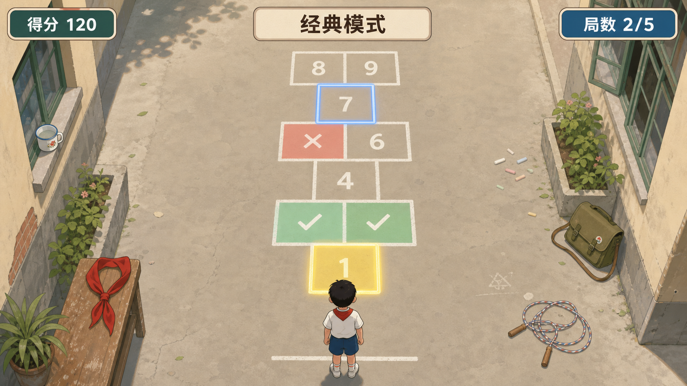

# MotionX Retro Pack / 跳房子游戏 GDD

> 本文是 `MotionX Retro Pack / 时光体感馆` 中「跳房子」玩法的单独 GDD。当前版本采用极简体感方案：主体路线保留两种核心姿势，`单脚站立` 对应单格，`双脚分开站立` 对应双格；终点格额外使用 `双脚并拢站立` 作为立定收尾姿势。游戏不加入弹珠、老师来了、轻跳、左右侧移、道具收集等额外条件，核心是让玩家看下一格、摆对姿势、沿粉笔路线前进，并用立定结束一张图。

## 游戏概述

「跳房子」是一款以放学后操场粉笔格子为主题的短局体感游戏。屏幕中显示一条粉笔画出的跳房子路线，玩家站在屏幕前，根据角色所在格的下一格做出对应姿势：

- 下一格是单格：玩家单脚站立。
- 下一格是双格：玩家双脚分开站立。
- 下一格是终点格：玩家双脚并拢站立，做出立定收尾。

系统每次只高亮角色所在格的下一格，并在格子内显示清晰脚印图标。玩家姿势正确，角色前进一格，格子边缘高亮扩散，播放正确音效并计分；玩家姿势错误，角色也前进一格，格子红光闪烁抖动，播放错误音效，不计分也不扣分。无论对错，经典模式都持续推进，保证轻松顺畅；无尽模式额外加入 3 点生命，错误扣 1 点生命，生命归零结束。终点格始终用双脚并拢站立收尾，让每张图以“立定”姿势完成。

游戏的核心体验是「看格子、换姿势、跳完路线」。它不复刻真实地面落脚，也不要求玩家真的向前跳、左右跳或精准踩线。玩家的体感姿势负责输入，屏幕角色负责在粉笔格子上前进。这样既保留童年跳房子的记忆，又降低摄像头体感误判和家庭运动风险。

## 1. 游戏定位

| 项目 | 定义 |
| --- | --- |
| 游戏名 | 跳房子 |
| 备选名 | 跳格子放学啦 / Hopscotch Dash |
| 童年原型 | 跳房子、跳格子、飞机格 |
| 所属主题馆 | 童年操场 |
| 内容线 | 放学后操场 / 粉笔格子 / 同学围观 |
| 推荐端 | 大屏端优先，移动端可做竖屏适配 |
| 推荐人数 | 1-2 人首发；长期可扩展 1-4 人轮流或分屏挑战 |
| 单局时长 | 教学约 30-45 秒；经典约 90-150 秒；无尽按生命结束 |
| 核心体验 | 看懂下一格，用单脚、双脚分开和终点立定让角色跳完整条粉笔路线 |
| 目标用户 | 亲子家庭、儿童、80/90 后父母、轻运动用户 |
| 设计关键词 | 两种主体姿势、终点立定、下一格判定、同图分屏、低误判、短局、失败不挫败 |

## 2. 设计目标

| 目标 | 设计要求 |
| --- | --- |
| 5 秒内看懂 | 玩家只需理解：单格单脚站，双格双脚分开站，终点双脚并拢立定 |
| 15 秒内学会 | 首局教学只演示两个主体姿势和一个终点姿势，不讲额外道具规则 |
| 识别稳定 | 不做真实地面落点、左右选择、前后深度、手势和跳跃判定 |
| 输入明确 | 每次只判定角色所在格的下一格，避免玩家预判多个格子导致误触 |
| 家庭安全 | 玩家基本原地运动，不鼓励连续跳、冲刺或大幅横移 |
| 失败轻松 | 经典模式错误也前进，不计分不扣分；无尽模式才扣生命 |
| 围观可读 | 下一格高亮、脚印图标、分数、连击、生命值都要远距离可见 |
| 双人公平 | 双人分屏时使用同一张随机格子图，各跳各的 |

## 3. 游戏 DNA 卡片

| 项目 | 设计 |
| --- | --- |
| 游戏名 | 跳房子 / 跳格子放学啦 |
| 所属主题馆 | 童年操场 |
| 场景一句话 | 放学后的操场上，同学们用粉笔画出一条跳格子路线，看谁能稳稳跳到终点 |
| 玩家身份 | 被同学喊来挑战粉笔路线的放学小伙伴 |
| 动作理由 | 角色下一格亮到哪里，玩家就摆出对应站姿；到终点时双脚并拢立定，结束这一张图 |
| 核心动作原语 | `SingleLegStand` + `WideStand` + `FeetTogetherStand` |
| 记忆触发音 | 下课铃、粉笔划线声、操场广播口哨 |
| 关键视觉锚点 | 粉笔跳房子格 + 下一格高亮 + 单脚 / 分脚 / 并脚图标 |
| 反馈语言 | “单脚站稳”“双脚打开”“到终点，立定”“跳准了”“这格没踩准，继续” |
| 结算记忆 | 称号：放学跳格王；标签：粉笔线不断档、站得真稳、同桌分屏赛 |

## 4. 核心玩法概述

玩家面对屏幕站在安全站位区。屏幕中显示粉笔格路线，角色初始站在起点。系统只高亮角色所在格的下一格，玩家根据下一格形态做出姿势。

核心循环：

```text
角色站在当前格
-> 下一格高亮并显示脚印图标
-> 玩家判断单格 / 双格 / 终点格
-> 做出单脚站立 / 双脚分开站立 / 双脚并拢立定
-> 系统判定姿势是否正确
-> 角色无论对错都前进一格
-> 正确计分并播放正确反馈；错误不计分并播放错误反馈
-> 进入下一格判定
```

这个循环的重点是“每一格都推进”。不要让玩家因为一次姿势错而卡住路线，否则体感游戏容易产生挫败和节奏断裂。

## 5. 格子排列规则

### 5.1 基础格子

| 格子类型 | 画面表现 | 玩家姿势 | 设计作用 |
| --- | --- | --- | --- |
| 单格 | 一个粉笔方格，格内显示一只脚图标 | 单脚站立，另一只脚抬起 | 保留传统“单脚跳”的记忆 |
| 双格 | 左右并排两个粉笔方格，每个格子各显示一只脚图标 | 双脚分开站立，身体稳定 | 表达传统“双脚落地”的节奏点 |
| 起点格 | 粉笔起跑线或小书包标记 | 默认站立 | 角色出发位置，不参与姿势判定 |
| 终点格 | 房顶形或终点粉笔框，格内显示双脚并拢图标 | 双脚并拢站立，回到起始立定姿势 | 明确路线结束，形成首尾呼应 |

### 5.2 排列硬规则

| 规则 | 说明 |
| --- | --- |
| 单格连续不超过 3 个 | 连续单格需要玩家单脚站、放下、再抬起，最多 3 个可接受 |
| 双格永远不连续 | 连续双格要求玩家重复做双脚分开站，动作变化弱，容易无输入或误判 |
| 双格后必须接单格 | 让玩家从双脚分开切回单脚站，形成清晰动作变化 |
| 单格到双格是有效变化 | 玩家从单脚站变成双脚分开站，识别清楚 |
| 双格只表达双脚分开 | 不要求玩家选择左格或右格 |
| 不做真实落点 | 玩家不需要真的踩地面格子 |
| 终点格固定立定 | 终点格不沿用前一格姿势，统一判定双脚并拢站立 |

### 5.3 合法排列示例

```text
S = 单格
D = 双格
F = 终点立定格

低难：S D S D S S D F
中难：S S D S D S S S D F
高难：S S S D S S D S S S D F
```

### 5.4 非法排列示例

```text
D D      # 双格连续，不允许
S S S S  # 单格连续超过 3 个，不允许
D D S    # 只要出现连续双格就不允许
```

### 5.5 难度来自排列复杂度

| 难度 | 路线特征 |
| --- | --- |
| 低难 | 单格和双格基本交替，单格连续最多 2 个 |
| 中难 | 偶尔出现 3 个连续单格，双格间隔更不规则 |
| 高难 | 连续 3 单格更频繁，路线更长，节奏窗口略短 |

## 6. 格子显示与判定

### 6.1 下一格判定

系统只判定角色所在格的下一格，不提前判定后续格子。

| 项目 | 规则 |
| --- | --- |
| 高亮对象 | 只高亮下一格 |
| 图标显示 | 单格显示一只脚；双格每个格子各显示一只脚；终点格显示双脚并拢 |
| 判定窗口 | 下一格高亮后开启 |
| 角色推进 | 判定结束后无论对错都前进一格 |
| 后续格 | 角色前进后，新的下一格再高亮 |

### 6.2 正确反馈

| 项目 | 表现 |
| --- | --- |
| 画面 | 当前格边缘高亮扩散，粉笔线向外轻轻亮开 |
| 音效 | 清脆粉笔敲击 / 轻快正确音 |
| 分数 | 本格计入姿势分、节奏分、稳定分 |
| 连击 | 连击 +1 |
| 角色 | 角色轻快跳到该格，动作干净 |

### 6.3 错误反馈

| 项目 | 表现 |
| --- | --- |
| 画面 | 当前格红光闪烁并轻微抖动 |
| 音效 | 短促擦线 / 错误音，不刺耳 |
| 分数 | 不计分，不扣分 |
| 连击 | 经典模式连击归零；无尽模式连击归零并扣 1 点生命 |
| 角色 | 角色仍然前进一格，用“踩歪但继续”的轻松表现 |

### 6.4 体感姿势定义

| 姿势 | 玩家行为 | 对应格子 | 判定重点 |
| --- | --- | --- | --- |
| 单脚站立 | 一只脚支撑身体，另一只脚抬起离地或膝盖明显上抬 | 单格 | 抬起腿的膝盖高度、支撑稳定度、保持时间 |
| 双脚分开站立 | 双脚自然分开，身体重心居中稳定 | 双格 | 两脚横向距离、身体中心稳定、保持时间 |
| 双脚并拢站立 | 双脚靠拢或自然并拢，身体回到起始立定姿势 | 终点格 | 两脚距离收窄、身体中心稳定、保持时间 |

### 6.5 判定参数建议

| 参数 | 建议值 | 说明 |
| --- | --- | --- |
| 动作预告 | 0.8-1.2 秒 | 下一格先亮起，玩家有反应时间 |
| 有效判定窗 | 1.2-1.8 秒 | 三种姿势都需要给儿童足够时间 |
| 姿势保持 | 0.35-0.6 秒 | 达到阈值后短暂稳定即可成功 |
| 命中冷却 | 0.3 秒 | 防止同一姿势连续触发多格 |
| 离区保护 | 2 秒 | 玩家离开站位区时暂停路线并引导回位 |

## 7. 玩法模式

### 7.1 教学模式

教学模式只给一张固定格子图，玩家跟着教学一步一步学会两个主体姿势、一个终点立定姿势和判定反馈。

| 项目 | 设计 |
| --- | --- |
| 路线数量 | 1 张固定教学图 |
| 推荐长度 | 6-8 格 |
| 路线示例 | S D S S D F |
| 教学节奏 | 每格暂停等待玩家完成，不强调倒计时 |
| 教学内容 | 单格单脚站、双格双脚分开、终点双脚并拢立定、正确反馈、错误也继续 |
| 结束条件 | 教学图走完 |

教学模式不加入生命值、不加入随机图、不加入双人竞争，目的只是让玩家形成最小认知闭环。

### 7.2 经典模式

经典模式随机给出 3 张格子图，难度依次递增。玩家全部跳完后计算总分。

| 项目 | 设计 |
| --- | --- |
| 路线数量 | 每局 3 张图 |
| 难度顺序 | 第 1 张低难，第 2 张中难，第 3 张高难 |
| 单图长度 | 低难 8-10 格，中难 10-14 格，高难 14-18 格 |
| 排列规则 | 单格连续不超过 3 个，双格永远不连续 |
| 错误处理 | 错误也前进一格，不计分不扣分，连击归零 |
| 结束条件 | 3 张图全部跳完 |
| 结算 | 统计三张图总分、正确率、最高连击、每图得分 |

双人经典模式采用分屏玩：两名玩家看到同一组随机格子图，各跳各的。系统分别判定、分别计分，最后展示个人合计分。

### 7.3 无尽模式

无尽模式每次进入时随机生成一条无尽格子图，并加入 3 点生命值。玩家持续跳格，错误扣 1 点生命，生命值归 0 后游戏结束。

| 项目 | 设计 |
| --- | --- |
| 路线数量 | 1 条持续生成的无尽路线 |
| 初始生命 | 3 点 |
| 错误处理 | 错误也前进一格，但扣 1 点生命 |
| 正确处理 | 正确计分，连击增加，不恢复生命 |
| 排列规则 | 单格连续不超过 3 个，双格永远不连续 |
| 难度成长 | 路线越远，单格连续频率提高，判定窗口略缩短 |
| 结束条件 | 生命值归 0 |
| 结算 | 跳过格数、总分、最高连击、坚持时间 |

双人无尽模式采用分屏玩：两名玩家看到同一条随机无尽图，各跳各的。两边路线排列保持一致，但生命、分数、连击独立计算。

## 8. 双人模式规则

| 项目 | 经典模式 | 无尽模式 |
| --- | --- | --- |
| 画面 | 左右分屏 | 左右分屏 |
| 格子图 | 两边完全一致 | 两边完全一致 |
| 判定 | 各跳各的，互不影响 | 各跳各的，生命独立 |
| 分数 | 个人总分 | 个人总格数 |
| 错误 | 不计分，连击归零 | 扣个人生命，连击归零 |
| 结束 | 两人都跳完 3 张图后结算 | 一方生命归零可先停，另一方可继续到生命归零 |

双人模式不要做同步判定。即使两人看到同一张图，也允许各自按自己的节奏跳，避免玩家因为节奏差异互相拖累。

## 9. 路线生成器

### 9.1 生成约束

```text
1. 主体格子只允许 S 或 D，路线末尾固定追加 F。
2. S 连续数量 <= 3。
3. D 连续数量 = 1，D 后不能接 D。
4. 起点不计入判定。
5. F 为终点立定格，不参与 S / D 连续规则。
6. 终点固定判定双脚并拢站立，不沿用最后一个主体格子的姿势类型。
```

### 9.2 生成流程

```text
确定路线长度
-> 根据难度确定 D 的比例和 S 连续概率
-> 从 S 开始生成更稳妥
-> 每次生成前检查前 1-3 格
-> 如果前一格是 D，则下一格强制 S
-> 如果前 3 格都是 S，则下一格强制 D
-> 主体路线生成完成后追加 F 终点格
-> 生成完成后做一次合法性校验
```

### 9.3 难度参数

| 参数 | 低难 | 中难 | 高难 | 无尽后期 |
| --- | --- | --- | --- | --- |
| 路线长度 | 8-10 | 10-14 | 14-18 | 持续生成 |
| S 最大连续 | 2 | 3 | 3 | 3 |
| D 比例 | 40%-50% | 30%-40% | 25%-35% | 20%-30% |
| 判定窗口 | 1.8 秒 | 1.5 秒 | 1.2 秒 | 1.0-1.2 秒 |
| 节奏预告 | 1.2 秒 | 1.0 秒 | 0.8 秒 | 0.7-0.8 秒 |

## 10. 得分与结算

### 10.1 基础得分

| 行为 | 分数 |
| --- | ---: |
| 正确完成当前格姿势 | +100 |
| 终点立定成功 | +200 |
| 单张图完成 | +300 |
| 经典模式三图完成 | +500 |
| 无尽模式每前进 10 格 | +200 |

错误姿势不计分、不扣分。只有无尽模式额外扣生命。

### 10.2 连击奖励

| 条件 | 奖励 |
| --- | ---: |
| 3 连击 | +100 |
| 5 连击 | +200 |
| 10 连击 | +500 |
| 单张图不断档 | +800 |

### 10.3 经典模式结算

| 结算项 | 说明 |
| --- | --- |
| 总分 | 3 张图累积分 |
| 跳准率 | 正确格数 / 总格数 |
| 最高连击 | 全局最高连续正确 |
| 三图成绩 | 分别展示第 1、2、3 张图得分 |
| 单脚正确率 | 单格正确次数 / 单格总数 |
| 双脚正确率 | 双格正确次数 / 双格总数 |

### 10.4 无尽模式结算

| 结算项 | 说明 |
| --- | --- |
| 总分 | 无尽期间累积分 |
| 跳过格数 | 角色实际前进总格数 |
| 坚持时间 | 从开始到生命归零 |
| 最高连击 | 本局最高连续正确 |
| 剩余生命 | 若主动退出或挑战结束时显示 |
| 最远纪录 | 和历史最佳比较 |

### 10.5 称号

| 称号 | 条件 |
| --- | --- |
| 放学跳格王 | 经典模式综合高分 |
| 粉笔线不断档 | 单张图全正确 |
| 金鸡独立小能手 | 单格正确率高 |
| 双格稳稳落地 | 双格正确率高 |
| 下课铃节拍王 | 跟拍率高 |
| 坚持到操场尽头 | 无尽模式格数高 |
| 同桌分屏王 | 双人模式胜出 |
| 全家总动员 | 双人家庭总分高 |

## 11. 视觉与 UI

### 11.1 游戏中画面

| 区域 | 内容 |
| --- | --- |
| 中央 | 粉笔路线、角色、下一格高亮 |
| 格子内部 | 单格一只脚图标；双格每个格子一只脚图标；终点双脚并拢图标 |
| 左上 | 分数 / 连击 |
| 右上 | 模式信息；无尽模式显示生命值 |
| 底部 | 当前姿势提示：单脚站稳 / 双脚打开 / 到终点立定 |
| 双人模式 | 左右分屏，两边路线图一致 |

### 11.2 正误反馈

| 状态 | 视觉 | 音效 | 文案 |
| --- | --- | --- | --- |
| 正确 | 格子边缘高亮扩散，粉笔线发亮 | 清脆正确音 | “跳准了” |
| 错误 | 格子红光闪烁抖动 | 短促错误音 | “这格没踩准，继续” |
| 无尽扣生命 | 生命图标少 1 点 | 轻短提示音 | “还剩 2 次机会” |
| 图完成 | 路线从起点到终点依次亮起 | 小结算音 | “这一张跳完了” |

### 11.3 画面风格

| 元素 | 方向 |
| --- | --- |
| 主场景 | 明亮干净的放学操场，暖阳、跑道、教学楼远景、同学围观剪影 |
| 格子 | 粉笔手绘质感，边缘自然但清晰 |
| UI | 现代清晰 HUD，少字、大数字、强对比 |
| 怀旧物件 | 粉笔盒、书包、奖状、广播喇叭，可放在边角 |

怀旧感来自具体童年物件和操场场景，不来自昏暗旧照片、VHS 滤镜或低清画质。

## 12. 音频设计

| 音频类型 | 方向 |
| --- | --- |
| 开场 | 下课铃、操场广播、粉笔划线声 |
| 格子提示 | 短促粉笔轻敲，单格和双格音色略有差异 |
| 正确 | 清脆粉笔点亮音 |
| 错误 | 轻微粉笔擦线声，不刺耳、不羞辱 |
| 连击 | 节拍逐渐明亮，配合路线点亮 |
| 结算 | 温暖完成感，像放学后跳完一条路线的小胜利 |

## 13. 摄像头与站位

| 项目 | 要求 |
| --- | --- |
| 单人站位 | 玩家站在屏幕中央，保持上半身、腿部和脚部尽量可见 |
| 双人站位 | 左右分屏，各自站在自己的粉笔站位圈 |
| 最小空间 | 不要求前后移动；左右留出自然分脚空间 |
| 动作安全 | 不鼓励大跳、冲刺、转身或蹲到过低 |
| 识别兜底 | 脚部不可见时，用膝盖高度、腿部角度和身体中心稳定辅助判断 |

所有入场提示都使用场景语言：`站到粉笔线后`、`让同学看到你`、`脚打开一点`。不要把技术流程暴露给玩家。

## 14. 首发范围

### 14.1 MVP 必须包含

| 模块 | 内容 |
| --- | --- |
| 教学模式 | 1 张固定教学图，逐格学习 |
| 经典模式 | 随机 3 张图，难度递增，跳完结算 |
| 无尽模式 | 随机无尽图，3 点生命，归零结束 |
| 双人分屏 | 经典 / 无尽均支持同图分屏，各跳各的 |
| 格子生成器 | 单格连续不超过 3，双格永远不连续 |
| 判定 | 只判下一格；单格、双格、终点格分别对应三种姿势；正确计分，错误前进不计分 |
| 结算 | 总分、正确率、最高连击、模式专属数据、称号 |

### 14.2 P1 扩展

| 模块 | 内容 |
| --- | --- |
| 路线皮肤 | 经典房子格、飞机格、长巷格、宽巷格 |
| 家庭排行 | 本地家庭榜，不强调竞技压力 |
| 自定义路线 | 家长或儿童选择单格 / 双格排列，系统校验合法性 |
| 贴纸奖励 | 轻收集与每日奖励 |

## 15. 风险与规避

| 风险 | 规避 |
| --- | --- |
| 连续双格动作变化弱 | 规则层禁止连续双格 |
| 连续单格过累或像跳跃 | 单格连续不超过 3 个 |
| 错误卡住路线 | 错误也前进一格，经典模式不扣分 |
| 无尽模式挫败 | 只有无尽扣生命，且生命值清晰显示为 3 点 |
| 双人路线不公平 | 双人使用同一张随机图，同排列、同难度 |
| 摄像头看不到脚 | 膝盖高度和腿部角度作为兜底 |
| 不同地区规则不一致 | 只保留单格 / 双格抽象，不宣称唯一正统规则 |
| 怀旧过重 | 场景明亮干净，怀旧物件点缀，UI 保持现代可读 |

## 16. 一句话产品判断

「跳房子」的核心不是让玩家真的跳到某个地面格子里，而是让玩家永远只看下一格：一个格子单脚站，两个格子双脚分开站，终点双脚并拢立定。对了就亮起来，错了也继续走，整条粉笔路线始终向前，并在终点稳稳收住。
