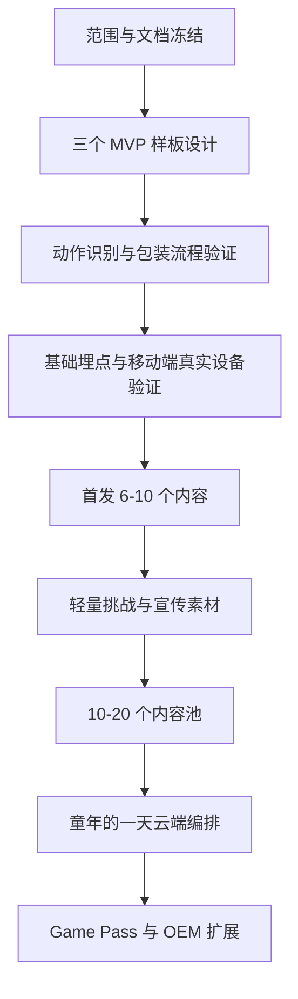

# MotionX Retro Pack / 里程碑计划

> 本文用于定义 `MotionX Retro Pack / 时光体感馆` 以手机版 MVP 为优先版本，从 MVP 验证到首发、成长运营和渠道扩展的阶段性里程碑。计划口径与 [MotionX-Retro-Pack-项目范围管理计划.md](./MotionX-Retro-Pack-项目范围管理计划.md)、[MotionX-Retro-Pack-MVP与系统模块分层方案.md](../设计方案/功能模块/MotionX-Retro-Pack-MVP与系统模块分层方案.md) 对齐。

## 1. 计划原则

| 原则 | 说明 |
| --- | --- |
| 先验证方向，再扩内容 | MVP 只验证三个主题馆方向、三个样板内容和一套复古体感包装流程是否成立 |
| 先闭环，再运营 | 未完成入口、识别、玩法、结算、埋点闭环前，不扩复杂活动、订阅和渠道承诺 |
| 合规先入门槛 | 国内联网版本中，账号实名、防沉迷、未成年人限制、隐私提示和付费拦截属于 P0 平台门槛 |
| 内容池先于时间线 | `童年的一天` 是云端编排路线，不是第四个主题馆；内容不足时不做完整时间线主入口 |
| 手机版优先 | 当前里程碑优先验证手机 / 平板产品包，先跑通竖屏浏览、横屏取景、触控、权限和移动端性能 |
| 双端同源，表现分端 | 移动端和大屏端是两个独立产品包，但游戏 ID、核心规则、流程、奖励和数据口径同源；大屏端放在后续复用扩展 |
| 每阶段有 Gate | 每个阶段必须有明确可交付物、验收标准和是否进入下一阶段的决策点 |

## 2. 阶段总览

| 阶段 | 目标 | 内容规模 | 核心交付 | Gate 结论 |
| --- | --- | --- | --- | --- |
| M0 方案冻结 | 统一范围、文档和样板定义 | 0 | 产品定义、范围计划、模块分层、样板清单 | 是否允许进入 MVP 制作 |
| M1 MVP 设计收敛 | 明确三个样板的流程、UI、音乐和动作判定 | 3 个样板设计 | 样板流程稿、UI 草图、音乐 demo 需求、动作原语表 | 是否允许进入开发验证 |
| M2 MVP 开发验证 | 跑通三个样板的手机版核心闭环 | 3 个样板可运行 | 手机 / 平板可演示版本、基础埋点、移动端兼容与性能验证记录 | 是否证明方向成立 |
| M3 首发内容包 | 扩展为可销售的基础内容包 | 6-10 个内容 | 主题馆内容池、轻量挑战、宣传素材、基础榜单 | 是否允许渠道首发 |
| M4 成长期运营 | 用活动和订阅更新提高复玩 | 10-20 个内容 | Game Pass 更新框架、每周/每月活动、轻收集扩展 | 是否启用《童年的一天》编排 |
| M5 渠道与 OEM 扩展 | 面向渠道和大屏端做轻量定制与商业复制 | 按渠道包 | 大屏端复用方案、OEM 一页纸、渠道皮肤、活动图、话术包 | 是否进入规模化复制 |

## 3. 里程碑详情

### 3.1 M0 方案冻结

| 项目 | 内容 |
| --- | --- |
| 阶段目标 | 把产品定位、手机版 MVP 范围、系统模块、双端边界和文档入口统一到同一口径 |
| 关键工作 | 确认当前主版本为手机 / 平板；确认三个主题馆、三个 MVP 样板、内容条目字段、`童年的一天` 编排边界、付费红线、合规门槛 |
| 主要交付物 | 产品定义、项目范围管理计划、MVP 与系统模块分层方案、风险登记册、付费设计方案 |
| 验收标准 | 文档之间不再冲突；MVP 不包含完整时间线、Game Pass、复杂任务、付费系统、深度 OEM；国内联网版本的实名、防沉迷、未成年人限制和隐私提示不被后置 |
| 决策点 | 是否冻结 MVP 范围并进入样板设计 |

### 3.2 M1 MVP 设计收敛

| 项目 | 内容 |
| --- | --- |
| 阶段目标 | 把三个样板从概念变成可实现、可验收的短局规格 |
| 内容范围 | `操场木头人`、`电玩城投篮机`、`家庭电视健美操` |
| 关键工作 | 定义每个样板的目标、动作原语、单局节奏、识别提示、失败兜底、结算反馈和奖励卡片模板 |
| UI 工作 | 完成移动端竖屏首页、主题页、玩法确认、结算、奖励与横屏识别 / 游戏 HUD 草图；大屏端只保留同源复用原则 |
| 音频工作 | 明确一套原创复古音乐 demo 和基础音效需求，不使用真实老歌或影视音乐 |
| 数据工作 | 定义入口点击、游戏点击、首局完成、复玩、退出、识别失败和合规拦截事件 |
| 验收标准 | 用户 5 秒内知道动作，30 秒内理解玩法；每个样板都有内容 ID、主题馆、动作、人数、时长、强度和状态 |
| 决策点 | 是否允许进入 MVP 开发验证 |

### 3.3 M2 MVP 开发验证

| 项目 | 内容 |
| --- | --- |
| 阶段目标 | 跑通三个样板的手机版可演示闭环，验证手机摄像头取景、识别、玩法和家庭复玩意愿 |
| 核心闭环 | 入口 -> 主题馆 -> 样板选择 -> 回忆开场 -> 入戏式识别 -> 核心玩法 -> 轻松反馈 -> 结算 |
| 技术工作 | 接入内容 ID、运行参数、动作原语识别、摄像头权限、横屏取景、设备摆放提示、识别失败兜底、基础多人支持 |
| 美术工作 | 完成移动端基础复古 UI、样板包装资产、结算界面、静态奖励卡片模板 |
| 测试工作 | iOS / Android 手机与平板的摄像头权限、取景、识别、性能和发热基础验证；成人、儿童、多人基础动作可用性观察 |
| 数据工作 | MVP 埋点可区分入口、主题馆、内容、完成、复玩、退出和识别失败 |
| 合规工作 | 国内联网版本跑通登录态、实名状态、防沉迷状态、未成年人时段 / 时长、付费限制、隐私提示和拦截原因码 |
| 验收标准 | 三个样板均可在手机 / 平板完整跑完 1-3 分钟；触控、权限、横屏取景、识别和性能无明显阻断；结算页能展示分数、称号、回忆标签；合规门禁能正确拦截未登录、未实名、超时、非可玩时段和付费受限状态 |
| 决策点 | 方向成立则进入首发内容包；方向不成立则回退样板、动作或包装流程 |

### 3.4 M3 首发内容包

| 项目 | 内容 |
| --- | --- |
| 阶段目标 | 从 MVP 样板扩展为可销售、可宣传、可渠道演示的基础内容包 |
| 内容规模 | 6-10 个复古主题内容 |
| 关键工作 | 扩展主题馆内容池，支持按主题馆、动作、强度、人数和时段标签筛选或推荐 |
| 运营工作 | 设计 1-2 个轻量首发挑战，不做复杂任务链，不做强制完整时间线 |
| 商业工作 | 准备移动端商店页、APK / TestFlight 或内部测试包、Game Pass / OEM 后续复用的一页纸、截图和 15 秒短视频 |
| 数据工作 | 支持按主题馆、样板、渠道拆分基础指标 |
| 验收标准 | 至少 6 个内容可稳定进入和完成；三个主题馆可稳定浏览；宣传素材不超过真实能力边界 |
| 决策点 | 是否允许进入渠道首发或小范围投放 |

### 3.5 M4 成长期运营

| 项目 | 内容 |
| --- | --- |
| 阶段目标 | 用周期活动、轻收集和云端编排提高复玩与订阅价值 |
| 内容规模 | 10-20 个内容 |
| 关键工作 | 建立每周家庭挑战、每月主题活动、节日游园会、暑假运动会、春节游园等活动节奏 |
| 编排工作 | 内容达到 10-20 个后，启用《童年的一天》云端编排入口，通过 `playlist_id` 下发路线 |
| 收集工作 | 扩展称号、徽章、纪念标签和主题奖励收藏位，不做 RPG 数值成长 |
| 商业工作 | Game Pass 承接持续活动权益；主题包和节日活动包作为后续扩展 |
| 验收标准 | 新内容不是简单换皮凑数；云端编排不复制内容库；客户端不写死固定时间线顺序 |
| 决策点 | 是否把《童年的一天》从弱标签升级为主体验入口 |

### 3.6 M5 渠道与 OEM 扩展

| 项目 | 内容 |
| --- | --- |
| 阶段目标 | 在不分叉底层玩法的前提下，支持大屏端复用、渠道定制和商业复制 |
| 关键工作 | 输出大屏端复用方案、OEM 一页纸、渠道皮肤、活动图、排序配置、渠道话术和版本边界 |
| 定制边界 | 可定制皮肤、音乐、排序、活动图和宣传话术；不定制底层玩法、识别逻辑和核心规则 |
| 风险控制 | 防止移动端首发、Lite / 大屏端、Game Pass、OEM 诉求冲突；所有新增需求进入范围变更评估 |
| 验收标准 | 渠道承诺不超过真实能力；不会形成移动端/大屏端两套不同内容池或规则体系 |
| 决策点 | 是否进入规模化渠道复制 |

## 4. 关键依赖关系

## 5. 阶段 Gate 检查表

| Gate | 必须回答的问题 | 不通过处理 |
| --- | --- | --- |
| M0 -> M1 | 手机版 MVP 范围是否冻结？三个样板是否明确？不做项是否写清？ | 回到范围计划和模块分层文档统一口径 |
| M1 -> M2 | 三个样板是否能被开发、测试和美术理解？动作是否落在 2D 单目稳定边界内？合规门禁字段是否进入开发范围？ | 降级动作、减少美术复杂度或重写样板流程；补齐合规字段后再进入开发 |
| M2 -> M3 | 三个样板是否在手机 / 平板完整跑通？权限、取景、识别和性能是否阻断？用户是否愿意再来一局？国内联网合规拦截是否正确？ | 修复识别、流程、结算或合规门禁；必要时回退样板设计 |
| M3 -> M4 | 6-10 个内容是否稳定？首发挑战是否不干扰主入口？宣传素材是否真实？ | 冻结扩内容，先修稳定性和渠道话术 |
| M4 -> M5 | 内容是否达到 10-20 个？云端编排是否可配置？Game Pass 是否有持续内容能力？ | 暂缓《童年的一天》主入口和渠道扩张 |

## 6. 不进入当前里程碑的内容

| 内容 | 处理方式 |
| --- | --- |
| 完整《童年的一天》强制通关主线 | 成长期内容达到 10-20 个后再评估 |
| 实时合影 / 换装 | 后续专项评估 |
| 完整西游剧情大冒险 | 后续节假日主题，不进入 MVP 和首发基础包 |
| 复杂等级、装备、货币、体力系统 | 不做，避免破坏轻量家庭短局体验 |
| 精确家庭同步率、真实地面落点、前后纵深移动 | 不进入当前 2D 单目稳定边界 |
| 海外市场版本、海外皮肤、海外营销话术 | 仅保留资料池，当前不制作 |
| 大屏端完整 UI 与电视盒子渠道版本 | 后续复用手机版内容池和规则后再评估，不进入当前手机版 MVP |
| 深度 OEM 底层玩法定制 | 不做，避免版本分叉 |
| 合规门禁后置 | 国内联网版本不后置；离线内部验证可用 mock 状态，但必须保留字段和拦截链路 |

## 7. 一句话总结

`MotionX Retro Pack` 的里程碑应按“方案冻结 -> 手机版 MVP 三样板验证 -> 移动端首发 6-10 个内容包 -> 成长期 10-20 个内容与《童年的一天》云端编排 -> 大屏端 / 渠道 / OEM 扩展”推进。当前最重要的是先在手机 / 平板上证明三个样板、复古包装流程、动作识别、家庭复玩意愿和国内联网合规门禁成立，而不是过早扩复杂运营、付费、电视盒子渠道或时间线主入口。
