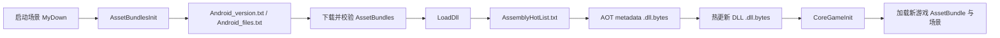

# 新游戏接入与热更新开发规范

> 适用项目：`RetroGame`
> 参考实现：`/Users/dukechen/Documents/unity_project/MotionSport_URP-Unity-2021.3.43f1-`（下称 B）
> 更新时间：2026-07-31
> 证据边界：本文依据当前 A、B 的目录、`asmdef`、`AssetBundlesInit`、`LoadDll` 与构建脚本静态核对写成。它是新游戏的落地规范，不替代一次真机发布验收。

## 1. 先理解本项目的加载边界

本项目不是“把场景放进 Build Settings 后直接进游戏”的单层结构。玩家启动后，热更新入口会先比对资源版本、下载更新文件，再读取远端 `AssemblyHotList.txt`，加载 AOT 补充元数据和热更新 DLL，最后进入 `CoreGameInit`。



相关事实来源：

- 资源版本与下载入口：`Assets/AssetBundlesLoadTools/AssetBundlesInit.cs`。
- DLL 清单、AOT 元数据和热更新 DLL 加载：`Assets/HybridCLR/MyHy/LoadDll.cs`。
- 热更后的公共入口场景：`Assets/CoreGameAssets/CoreGameMain_Ban/Scene/CoreGameInit.unity`。
- 当前 A 的热更新清单：`Assets/AssemblyHotList.txt`，现有条目为 `AssemblyUpdateScriptsHOT`。

**结论：**新游戏的资源、脚本、清单和发布文件必须是一组一致的产物；只提交 C# 或只上传场景，都不能构成可用热更。

## 2. 新游戏目录模板

新游戏使用稳定的游戏标识 `<Game>`（推荐 PascalCase，例如 `Archery`），并在资产与代码两侧各建一个同名根目录。不要把新游戏内容混入 `CoreGameMain_Ban`、`SportPublic*` 或无归属的根目录。

```text
Assets/
├── CoreGameAssets/
│   ├── <Game>_Assets/
│   │   ├── Scenes/             # 游戏场景；如项目已有 Scene 命名，也可统一使用 Scene
│   │   ├── Prefabs/
│   │   ├── Models/
│   │   ├── Materials/
│   │   ├── Textures/
│   │   ├── Audios/
│   │   ├── Animations/
│   │   ├── Config/             # ScriptableObject、游戏内配置等
│   │   ├── RenderTextures/
│   │   └── LightingSetting/
│   ├── SportPublicTexture/     # 多游戏真正共用的图片/Spine/UI 图集
│   ├── SportPublicAudio/       # 多游戏真正共用的音频
│   ├── SportPerfabs/           # 可跨游戏复用的 Prefab
│   └── SportPerfabsPrivate/    # 仅公共框架使用的私有 Prefab
├── CoreGameScript/
│   ├── AssemblyUpdateScriptsHOT/       # 当前 A 已配置的唯一 HOT 程序集根
│   │   ├── <Game>/
│   │   │   ├── Runtime/                # 游戏流程、玩法、状态机
│   │   │   ├── Input/                  # Pose/手势到玩法的适配，不直接复制 PoseAPI
│   │   │   ├── UI/
│   │   │   ├── Data/
│   │   │   └── Config/
│   │   └── AssemblyUpdateScriptsHOT.asmdef
│   ├── AssemblyUpdateScriptsAOT/
│   └── <Game>_Script/                  # 可选：随包发布的独立程序集，非默认 HOT 位置
└── ...
```

B 中的 `Basketball_Assets`、`Tennis_Assets`、`Ski_Assets` 与对应脚本目录体现了“资产和代码按游戏成对归属”。但保龄球 `Bowing_Script/AssemblyBowling.asmdef` 是**随包的独立程序集**：不在 B 的 `AssemblyHotList.txt`，也未配置到 B 的 HybridCLR 热更新程序集列表。因此它适合作为资产/玩法分组范本，不能直接当作当前 A 的 HOT 打包范本。历史目录存在 `Scene/Scenes`、`prefabs/Prefabs` 等大小写不一致；**新目录统一按本模板命名**，不要再扩散历史写法。

### 2.1 资产放置规则

| 内容 | 放置位置 | 规则 |
| --- | --- | --- |
| 某一个游戏独有的场景、模型、贴图、音频、配置 | `Assets/CoreGameAssets/<Game>_Assets/` | 和该游戏一起打包、更新、回滚。 |
| 两个及以上游戏都复用且已确认由公共负责人维护的资源 | 对应 `SportPublicTexture`、`SportPublicAudio`、`SportPerfabs` | 提交前确认引用方；不要把“未来可能复用”的资源提前公共化。 |
| 启动、下载、公共大厅资源 | `CoreGameMain_Ban` 或现有公共目录 | 不是新游戏目录的默认落点，改动需评估所有游戏。 |
| 仅随安装包发布、启动前不可缺少的文件 | `Assets/StreamingAssets` | 仅放构建脚本生成或明确要求随包发布的文件；不要手工把整套新游戏资源塞入这里。 |
| 临时导入源文件、PSD、录屏、外部工具缓存 | `Assets` 以外的受控原始资源仓库 | 不进入运行时 AssetBundle；如确需保留，建立清晰的 `Raw` 管理规范并排除构建。 |

资源导入后，先在 Unity 中为目标资产设置项目既有的 AssetBundle 标记/分组，再执行项目的 AssetBundle 构建。不要通过手改 `.meta` 或 Scene YAML 来“补”序列化关系。

## 3. 代码与程序集：HOT / AOT 怎么选

### 3.1 当前 A 的默认做法：HOT 根目录下按游戏分目录

**目录完全可以有。**Unity 的编译边界由 `.asmdef` 决定，不由普通文件夹决定。当前 A 的 `ProjectSettings/HybridCLRSettings.asset` 只配置了 `AssemblyUpdateScriptsHOT` 为热更新程序集；因此新游戏需要热更的 C# 默认放在：

```text
Assets/CoreGameScript/AssemblyUpdateScriptsHOT/<Game>/
```

可以继续细分 `Runtime/`、`Input/`、`UI/`、`Data/`、`Config/`。这些都是普通子目录，且只要子目录里**不新增 `.asmdef`**，代码仍会被编入 `AssemblyUpdateScriptsHOT.dll`，现有 `AssemblyHotList.txt` 已会加载该 DLL。

```text
AssemblyUpdateScriptsHOT.asmdef 的作用域
└── AssemblyUpdateScriptsHOT/
    ├── <GameA>/Runtime/...
    ├── <GameA>/UI/...
    └── <GameB>/Input/...
```

不要将需要 HOT 的代码放在同级 `Assets/CoreGameScript/<Game>_Script/` 后又新增 `Assembly<Game>.asmdef`，并误以为它会自动热更；这会产生一个新的程序集，而当前 A 的构建复制流程不会自动把它当作 HOT DLL 发布。

| 放入位置 | 适合内容 | 不适合内容 |
| --- | --- | --- |
| `AssemblyUpdateScriptsAOT` | 启动前就需要的桥接代码、加载器依赖、原生/平台接口稳定外观、被大量泛型/AOT 调用且必须随包提供的公共代码 | 高频改动的玩法、游戏 UI、独立游戏规则。 |
| `AssemblyUpdateScriptsHOT/<Game>/`（默认） | 新游戏可热更的玩法、UI、状态、输入适配；用子目录隔离游戏 | `Editor` 和测试代码；也不能把启动器加载前必须执行的代码放入这里。 |
| `Assembly<Game>` 独立 asmdef（高级改造） | 有明确独立 DLL、独立发布/回滚需求，并愿意维护 HybridCLR 和发布链的游戏 | 未改 HybridCLR 配置、未增加 DLL 产物/清单验证时的普通新游戏。 |

### 3.2 何时才能新增独立热更新程序集

假设新程序集名称为 `AssemblyArchery`：

1. 创建 `Assets/CoreGameScript/Archery_Script/AssemblyArchery.asmdef`，使所有玩法脚本落在该程序集内。
2. 将该 asmdef 加入 `ProjectSettings/HybridCLRSettings.asset` 的 `hotUpdateAssemblyDefinitions`（通过 HybridCLR 的 Unity 设置界面配置，不手改 GUID）。
3. 在 `Assets/AssemblyHotList.txt` 新增一行 `AssemblyArchery`。名称必须与程序集名完全一致，且不要带 `.dll`、`.bytes`、空格或空行。
4. 执行 `BuildAndCopyABAOTHotUpdateDlls()` 后，确认它实际复制出了 `AssemblyArchery.dll.bytes`；没有产物时，不得发布清单。
5. 确认新 DLL 所依赖的 AOT DLL 已在 `LoadDll.AOTMetaAssemblyFiles` 和实际 AOT 产物中可用；新增泛型/三方程序集时尤其要验证。

当前 A 的热更清单只列出 `AssemblyUpdateScriptsHOT`，HybridCLR 设置也只配置该程序集。**新增游戏程序集但不同时更新 HybridCLR 设置、清单和发布产物，真机不会加载该 DLL。**

### 3.3 依赖方向

保持单向依赖，避免游戏之间互相引用：

```text
公共 AOT / 公共运行时
        ↑
PoseAPI、GameCore、通用 UI/工具
        ↑
AssemblyUpdateScriptsHOT/<Game>（默认 HOT 玩法代码）
        ↑
<Game>_Assets（Prefab / Scene 上挂载对应玩法组件）
```

- 游戏 A 不应引用游戏 B 的程序集或私有 Prefab；抽出的共性先经过公共模块评审。
- `Editor`、`Tests` 使用独立 asmdef，不能进入运行时 HOT DLL；它们不能放在 `AssemblyUpdateScriptsHOT/<Game>/` 下。
- 改程序集名时，要同步更新 `AssemblyHotList.txt`、DLL 发布文件、可能的反射字符串和资源引用；这不是普通的文件重命名。

## 4. 场景、启动与 PoseAPI 接入

### 4.1 场景职责

- `MyDown`：下载/版本检查/热更新 DLL 加载入口，不放某个新游戏的业务逻辑。
- `CoreGameInit`：热更新资源和 DLL 就绪后的公共入口。
- `<Game>_Main`：新游戏实际运行场景，建议位于 `Assets/CoreGameAssets/<Game>_Assets/Scenes/`。

新游戏应由已有的公共入口或菜单在 `CoreGameInit` 之后加载；不要绕过热更链，在启动场景直接引用只存在于热更包内的类型或资源。

### 4.2 体感游戏的 PoseAPI 约束

当前 A 已升级为与 B 对齐的 PoseAPI 结构。新体感游戏必须复用它，而不是另建 HTTP client、相机采集链或第二份骨架数据总线。

- `PoseFrame20` 是 UI/玩法使用的统一 20 点公开数据总线；33 点兼容数据仍可能被旧的坐标显示、篮球或滑雪逻辑消费。
- 直接进入游戏场景时，场景中只保留一套 `GameCoreBootstrap + AddInit` 来创建、初始化并播放 `GameCore` 相机。
- Pose 相关显示、管理器和数据源按现有 `PoseAPI` Prefab/组件配置；同一场景不要重复挂 `PoseAPIManager`。
- Android Player 使用 SDK 路径；非 Android 才根据 Inspector 的 `sourceType` 选择数据源。Mac 本地 YOLO 使用 `GameCore.Camera.CameraTexture`，不要自行额外开相机。
- 新游戏只在 `Input/` 中写“姿态/动作 -> 游戏语义”的适配层，例如 `ArcheryPoseInput`；不要修改 `Assets/Scripts/PoseAPI` 的公共合同来满足单个游戏。

场景组件和引用请在 Unity 编辑器中配置并保存，再使用 UnityMCP/Editor 回读验证。禁止直接编辑 `.unity` YAML 来绕过序列化和引用校验。

## 5. 资源与热更新发布流程

### 5.1 开发阶段

1. 创建 `<Game>_Assets` 与 `AssemblyUpdateScriptsHOT/<Game>`，先确定游戏标识和主场景名。
2. 导入资源到游戏私有目录，设置 AssetBundle 分组；创建 `<Game>_Main` 场景和 Prefab。
3. 在 `AssemblyUpdateScriptsHOT/<Game>` 内完成玩法、UI、输入适配和配置；默认不新增 asmdef。
4. 在编辑器内配置并保存场景；检查无 Missing Script、无跨游戏私有引用、无重复 Pose 管理器。
5. 需要热更新时，将程序集名写入 `Assets/AssemblyHotList.txt`，并确保构建脚本能产出对应 `.dll.bytes`。

### 5.2 构建与发布阶段

执行 `Assets/HybridCLR/Editor/HybridCLR/BuildAssetsCommand.cs` 中的 `BuildAndCopyABAOTHotUpdateDlls()`，它会：

1. 构建 AssetBundle；
2. 编译 HOT DLL；
3. 复制 AssetBundle、AOT 元数据 DLL、HOT DLL 到 `StreamingAssets` 侧的发布输入。

随后由实际发布流程生成并上传版本文件、资源包、`.dll.bytes` 和 `AssemblyHotList.txt`。启动器会从服务端读取 `Android_version.txt`、`Android_files.txt`，再下载需要更新的文件。

> 重要：`Assets/Editor/BuildAndroidCommand.cs` 直接调用 `BuildPipeline.BuildPlayer`，当前没有调用 `BuildAndCopyABAOTHotUpdateDlls()`；不能假设“打一次 Android 包”就已生成可发布的热更新 DLL/资源。`Assets/HybridCLR/Editor/HybridCLR/BuildPlayerCommand.cs` 虽会在 Player 构建后调用该方法，但它的产物路径与 Android 发布任务是否一致，仍须按当次发布命令实测确认。

### 5.3 每次发布的最小产物核对

| 核对项 | 必须证明的事实 |
| --- | --- |
| DLL 清单 | 远端 `AssemblyHotList.txt` 与本次计划热更程序集完全一致。 |
| 热更新 DLL | 清单每一项均有同名 `<Assembly>.dll.bytes`，文件非空且来自本次构建。 |
| AOT 元数据 | `LoadDll.AOTMetaAssemblyFiles` 所需 `.dll.bytes` 均在发布输入/服务端可取到。 |
| 资源包 | 新游戏场景、Prefab、依赖资源都在本次 AssetBundle 输出及版本清单中。 |
| 版本文件 | `Android_version.txt`、`Android_files.txt` 与上传目录、MD5/大小保持一致。 |
| 真机 | 清缓存/旧版本启动可下载、加载 DLL、进入 `CoreGameInit`、再进入 `<Game>_Main`。 |

任何一项未验证，都只能称为“构建产物已生成”，不能称为“热更新已发布成功”。

## 6. 新游戏验收清单

### 静态与编辑器验收

- [ ] 资产仅在 `CoreGameAssets/<Game>_Assets` 或确认过的公共目录。
- [ ] 需要热更的代码在 `CoreGameScript/AssemblyUpdateScriptsHOT/<Game>`，且子目录没有新的运行时 asmdef。
- [ ] Unity 无编译错误、无 Missing Script；`Editor`/`Tests` 未进入运行时程序集。
- [ ] 主场景已保存，Prefab 和 ScriptableObject 引用完整。
- [ ] 场景没有跨游戏私有资源依赖，也没有重复的 `GameCoreBootstrap`、`AddInit`、`PoseAPIManager`。
- [ ] 使用 PoseAPI 的游戏只写输入适配层，未复制相机/骨架/数据源实现。

### 热更新与设备验收

- [ ] `AssemblyHotList.txt`、HOT DLL、AOT 元数据、AssetBundle 和版本文件来自同一次构建。
- [ ] 服务端目录和版本清单的文件名、大小、校验信息一致。
- [ ] 冷启动/清缓存设备可完成下载和 DLL 加载，无 `LoadMetadataForAOTAssembly` 或 `Assembly.Load` 异常。
- [ ] 可从 `CoreGameInit` 正常进入新游戏场景。
- [ ] 体感游戏已在目标设备实际验证相机、Pose 数据、单/双人模式、镜像与核心玩法；Unity Editor 可运行不等于设备验收通过。

## 7. 禁止事项与常见误区

1. 不把 HOT 代码放到 `AssemblyUpdateScriptsHOT` 的同级目录后另建 asmdef 并期待自动加载；当前标准做法是在其下按 `<Game>` 建子目录。
2. 不把新游戏资源直接塞进 `StreamingAssets`；这里是发布输入，不是项目资产分类目录。
3. 不只上传 DLL 或只上传 AssetBundle；它们必须与清单、版本文件一起发布。
4. 不通过手改 Scene YAML、`.meta` 或复制 B 的 asmdef GUID 配置场景/依赖。
5. 不在单个游戏里复制/二次初始化 PoseAPI、GameCore 相机或下载器。
6. 不以“APK 构建成功”替代热更新发布验证；当前 `BuildAndroidCommand` 不负责执行完整的 DLL/AssetBundle 复制步骤。

## 8. 新游戏创建前的命名记录

在建立目录前，将以下内容写入该游戏自己的 `Docs/接入记录.md`，供资源、客户端和发布同学共用：

```markdown
# <Game> 接入记录

- 游戏标识：<Game>
- 主场景：<Game>_Main
- HOT 代码目录：AssemblyUpdateScriptsHOT/<Game>
- 是否新增独立程序集：否（默认）/ 是（需 HybridCLR 配置和发布链改造）
- AssemblyHotList 条目：AssemblyUpdateScriptsHOT / Assembly<Game>
- AssetBundle 分组：<待填写>
- 入口菜单/加载方式：<待填写>
- PoseAPI 需求：单人/双人；目标平台；动作输入适配类
- 公共资源依赖：<待填写>
- 首次发布版本与资源版本：<待填写>
- 负责人：<待填写>
```

这样每个新游戏都能在开发开始前明确资源归属、程序集边界、热更新清单和设备验收责任。
