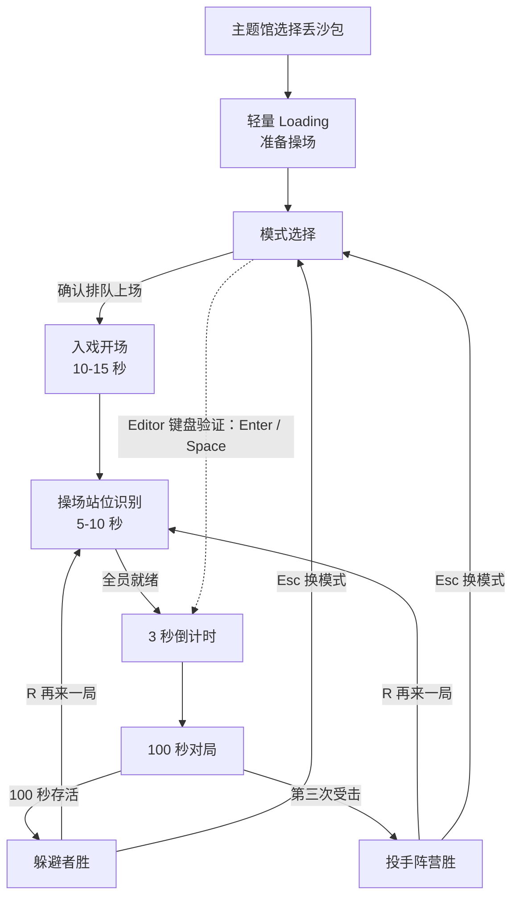
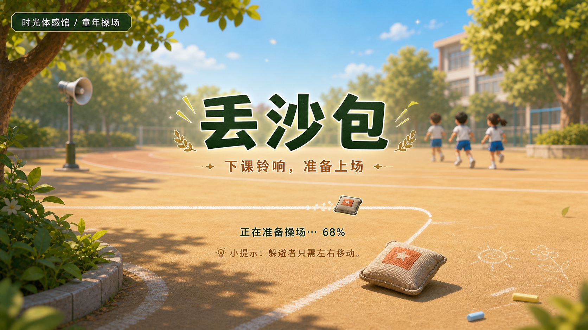
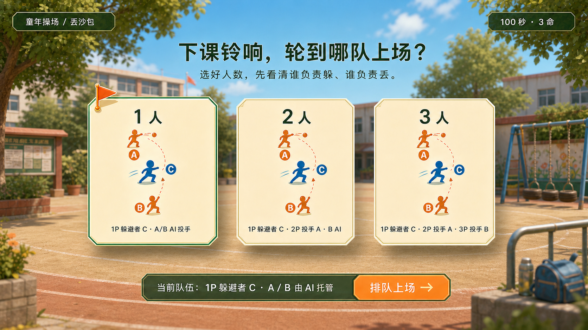
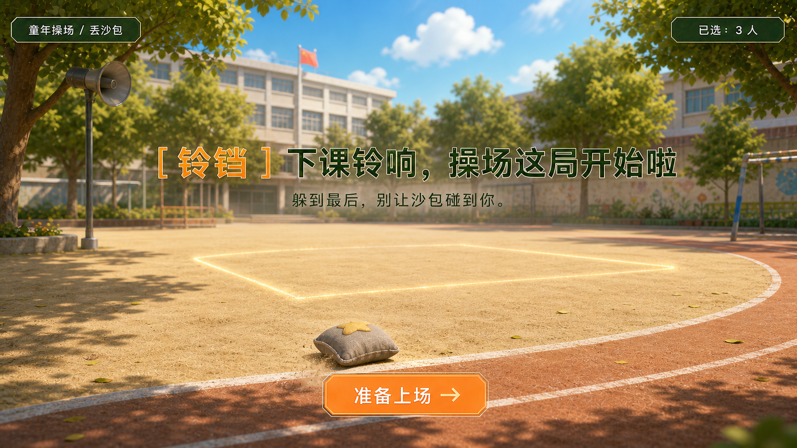
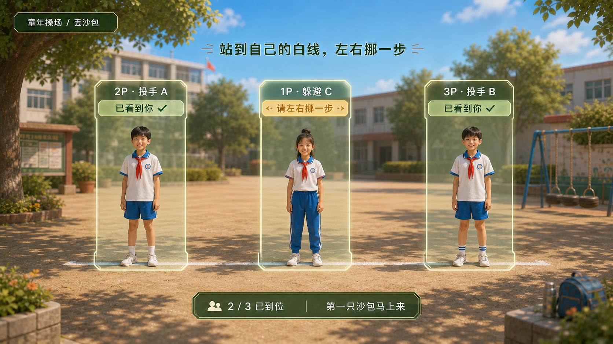
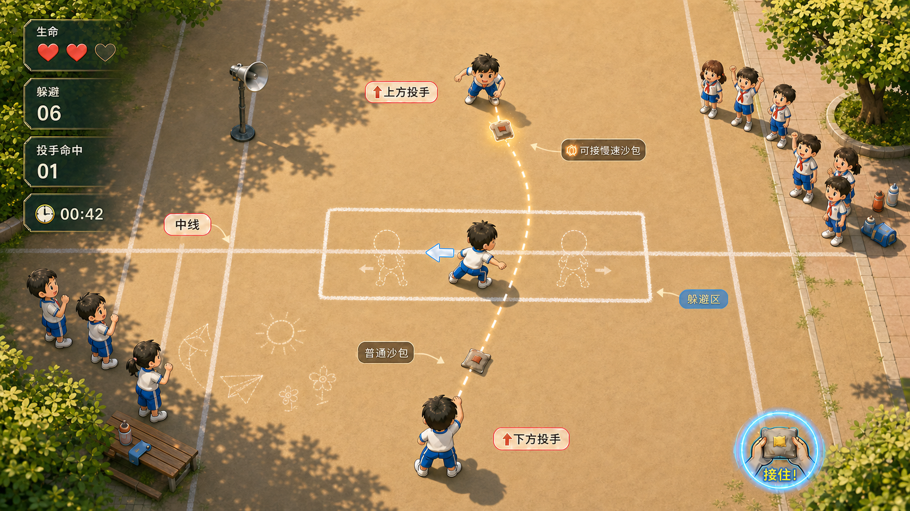
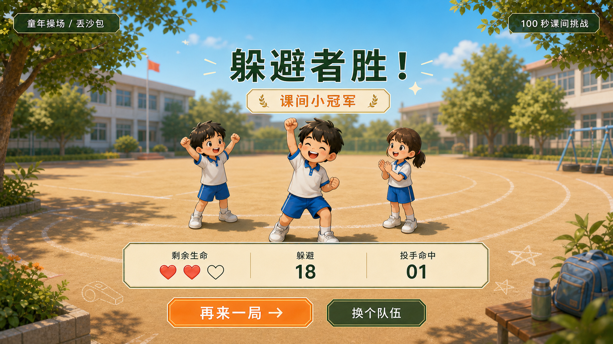

# 1-3 人完整单局：入戏式识别与键盘验证界面原型

## 基本信息

| 字段 | 内容 |
|---|---|
| 游戏 / 功能 | 体感丢沙包 / 1-3 人完整单局；正式体感入戏式识别 + Editor 键盘验证 |
| 版本 / 日期 | 2026-07-22 |
| 设计来源 | GDD、多人功能增量简报、`multiplayer-complete-session` Epic 与系统设计 |
| 当前平台 | Unity Editor + 同一键盘（仅验证流程与多人规则） |
| 正式平台 | 安卓大屏/电视盒子 + 2D 体感输入 |
| 输入方式 | 正式流程：主题馆选择丢沙包后，先进入轻量 Loading，再选择人数、确认“排队上场”并进入入戏开场、操场站位识别与倒计时；键盘验证：模式页 `1/2/3` 直选、`Enter/Space` 确认并跳过开场与识别后开始倒计时，对局 1P `A/D`、2P `J/L + I`、3P `←/→ + ↑`，结算 `R` 再来一局、`Esc` 返回模式选择。 |
| 视角与观看距离 | 横版 16:9、45 度俯视 2D；按电视约 3 米远距阅读设计。 |

### 场地视角基准

对局始终采用“从上往下看操场”的 45 度俯视视角：**屏幕上方 / 场地远端是投手 A，屏幕正中是躲避者 C，屏幕下方 / 场地近端是投手 B**。C 只在中间躲避区横向移动。

- A 持球时，预警线与沙包轨迹从屏幕上方朝 C 向下；B 持球时，从屏幕下方朝 C 向上。
- 生命、倒计时、阵容、当前持球和命中统计是屏幕固定 HUD，可横向排布在边缘；它们不能替代或反转场地内 `A 上 / C 中 / B 下` 的空间语义。
- 摄像头识别的左 / 中 / 右仅用于现实世界中锁定 1P / 2P / 3P 身份，不对应游戏场地的上下方位。

## 交互原则

- 正式体验遵循“主题馆选择丢沙包 → 轻量 Loading → 选人数 → 入戏开场 → 入戏式识别 → 操场站位确认 → 倒计时 → 对局”；键盘验证可跳过开场与识别，但不得作为正式体验流程。
- 入戏式识别用“准备上场”“站到白线中间”“让同学看到你”等场景语言包装，不出现“校准”“骨骼识别”等技术词。
- 每个页面只突出一个下一步：选人数、排队上场、开始倒计时、躲避/出手或重开。
- 游戏中 HUD 只占四角与上下边缘；中央躲避区、沙包轨迹和预警线永远优先。
- 童年操场用跑道弧线、粉笔躲避区、下课铃三项主锚点；小口哨、粉笔头和远处广播喇叭仅放边缘。
- 重要状态不只靠颜色：模式、持球者、生命、预警和胜负都同时使用文字、图标/形状及轻动效。

## 玩家场景

| 场景 | 玩家目标 | 当前压力 | 最需要的信息 | 下一步 |
|---|---|---|---|---|
| 主题馆 Loading | 知道已进入丢沙包，感到操场正在准备 | 等待切场与资源准备 | 游戏名、下课铃、沙包、轻量加载进度 | 自动进入模式选择 |
| 模式选择 | 选对人数与角色关系 | 多人同屏首次理解成本 | 谁控制 C/A/B、这一局谁在场 | 确认“排队上场”；键盘验证按 `Enter/Space` 跳过开场与识别 |
| 入戏开场 | 知道身处操场、正在玩丢沙包 | 首局等待 | 下课铃、操场白线、沙包与“躲到最后” | 看见“准备上场”后进入站位识别 |
| 入戏式识别 | 让系统和同伴看到自己、站到正确位置 | 身体未入框或玩家重叠 | 个人颜色站位框、已看到你/请回到白线、左右活动提示 | 全员就绪后进入倒计时 |
| 倒计时 | 建立上下投手与中间躲避区关系 | 即将开局 | 3、2、1 与当前角色 | 等待开始 |
| 对局中 | C 躲开沙包；投手阵营制造命中 | 实时躲避和投掷压力 | 时间、生命、当前持球者、动作提示、预警 | 正式体验按动作提示；键盘验证用 `A/D`、`J/L/I`、`←/→/↑` |
| 结算 | 读懂谁赢、表现如何、马上再玩 | 复盘但不拖慢轮换 | 阵营胜负、生命、评级、命中 | `R` 重开或 `Esc` 换模式 |

## 信息层级

| 信息 | 类型 | 出现时机 | 优先级 | 表现建议 | 隐藏条件 |
|---|---|---|---|---|---|
| 倒计时 / 剩余时间 | 持续 | 倒计时开始至结算前 | P0 | 左侧纵向状态栏的底部独立时钟牌，白字深色描边 | 结算后移入结果卡 |
| C 剩余生命 | 持续 | 对局全程 | P0 | 左侧纵向状态栏首块：三颗沙包/心形图标 + `生命` 文字 | 结算后移入结果卡 |
| 当前持球者与预警方向 | 条件 | A/B 持球、预警和出手时 | P0 | 屏幕上/下侧投手头顶的持球牌 + 指向 C 的粗预警线；顶部中央只复述当前投手 | 无预警或结算 |
| 当前模式与角色 owner | 持续 | 模式选择、对局、结算 | P1 | 右上三席阵容小条：`1P 躲 / 2P 投 / 3P 投`，当前持球席位加旗标 | 不隐藏 |
| Loading 状态 | 持续 | 从主题馆选择丢沙包至模式选择可用前 | P1 | 粉笔线式进度轨 + 沙包标记 + 短文案 `正在准备操场…`；不显示技术资源名或百分比错误诊断 | 模式选择首帧可用后淡出 |
| 入戏开场提示 | 条件 | 入戏开场 | P1 | 下课铃、操场广播、白线与一句任务文案 | 进入站位识别后消失 |
| 站位识别状态 | 条件 | 入戏式识别 | P0 | 每人独立颜色站位框、身体轮廓/简笔角色和“已看到你”状态 | 全员就绪或退出时消失 |
| 当前玩家键位 | 条件 | 首局前 8 秒、持球人变化 | P1 | 底边色标键位牌；当前 owner 轻跳动 | 首局提示结束后收为小条 |
| 躲避/投手命中统计 | 持续 | 对局与结算 | P2 | 左侧纵向状态栏的两块透明信息带：`躲避` / `投手命中`；不抢时间和生命 | 结算后合并结果卡 |
| 擦身、命中、接球 | 反馈 | 状态变化瞬间 | P1 | 短字 + 图标 + 原创短音；不弹长面板 | 0.6-1.0 秒后消失 |
| 童年场景装饰 | 低优先级 | 全程 | P3 | 跑道、粉笔格、口哨、远处喇叭放在边缘/远景 | 不遮挡动作区 |

## 主流程



## 界面原型

### 0. 主题馆进入 Loading



- 这是从主页主题馆选择“丢沙包”后的过渡页，目的仅是确认“已进入童年操场”并遮蔽场景/资源准备，不承担模式教学、角色分配或玩法说明。
- 视觉锚点固定为下课铃、单颗沙包、白色粉笔进度线和干净操场远景；加载轨上的沙包沿粉笔线前进，文案可为 `正在准备操场…`。加载过程不显示 SDK、资源包、网络、百分比错误或其他技术诊断。
- Loading 时长应由实际可进入模式选择的准备状态决定；当准备极短时，至少保持约 0.6 秒以避免闪屏，但不得人为阻塞玩家。进入模式选择后 Loading 立即淡出，不要求确认操作。
- 这是用于确认构图、信息层级与过渡状态的 AI 概念草图（非最终美术、非 Photoshop PSD、非 Unity 可用资源）。

### 1. 模式选择

```text
┌──────────────────────────────────────────────────────────────────────────────┐
│  [返回]  童年操场 / 丢沙包                                  100 秒 · 3 命  │
│                                                                              │
│                       下课铃响，轮到哪队上场？                               │
│                    选好人数，先看清谁负责躲、谁负责丢。                      │
│                                                                              │
│   ╭──────────╮       ╭──────────╮       ╭──────────╮                       │
│   │ 1 人 ▲   │       │ 2 人     │       │ 3 人     │                       │
│   │ A↑ C B↓  │       │ A↑ 2P · C 1P│    │A↑ 2P · C 1P · B↓ 3P│             │
│   │ A/B：AI  │       │ B：AI    │       │  全员到位  │                       │
│   ╰──────────╯       ╰──────────╯       ╰──────────╯                       │
│                                                                              │
│      当前队伍：1P 躲避者 C · A / B 由 AI 托管      [ 排队上场 → ]           │
│  跑道弧线、粉笔格、广播杆只停在远景与底边，绝不压住队伍卡与 CTA。            │
└──────────────────────────────────────────────────────────────────────────────┘
```



> 这是用于确认构图、信息层级与镜头角度的 AI 概念草图（非最终美术、非 Photoshop PSD、非 Unity 可用资源）。角色 owner 以本规格为准：C 是 1P 躲避者，A 是 2P 投手，B 是 3P 投手；未参与的投手由 AI 托管。

#### 页面定位与情绪

- 页面是进入单局前的 **课间点名台**，不是游戏包大厅、班级荣誉墙或旧物件陈列。玩家身份是“准备上场的同学”：先分清谁站中间躲、谁在两侧投，再进操场。
- 第一眼必须读到“童年操场 + 丢沙包 + 选队伍”，第二眼读到固定阵容，第三眼才在边缘发现回忆细节。背景只提供空气感，不讲完整校园故事。
- 童年操场的主锚点固定为 **跑道线、粉笔格、下课铃/广播远影**；二级细节只从 **单颗沙包、小口哨、搪瓷杯、两三段粉笔头、值日小卡** 中取 3-5 个，放在底边或卡片缝隙。不得加入旗墙、奖状墙、红领巾堆叠或满屏器材。

#### 顶级完成度的视觉骨架

| 区域 | 设计 | 信息职责 | 风格与远距规则 |
|---|---|---|---|
| 顶部轻栏 | 左侧统一返回按钮，中间小型主题面包屑，右侧固定显示 `100 秒 · 3 命` | 确认场景与本局固定规则 | 不重复产品品牌；米白底、深绿字、细橙红点题，距边缘至少 5% 安全区。 |
| 标题区 | `下课铃响，轮到哪队上场？`；下一行只解释“选好人数，先看清谁负责躲、谁负责丢。” | 给父母场景记忆，给孩子直接任务 | 高对比节目式标题；不用儿童节目粗黑描边、手写涂鸦字或满屏贴纸。 |
| 队伍卡列 | 三张横向队伍卡；上半部是 `A 上 / C 中 / B 下` 站位示意，下半部是逐行 owner 文案 | 3 秒内说出每种人数下谁是人、谁是 AI | 现代平面米白卡、草绿边与操场红状态点；仅 8-16 px 轻微错位和图钉/旗标，不做厚重立体、玻璃高光或拟真纸材质。 |
| 已选队伍条 | 复述已选阵容，紧贴主 CTA | 消除“选到哪一队”的不确定性 | `1P 躲避者 C · A / B 由 AI 托管` 优先于只显示彩色人头。 |
| 主 CTA | `排队上场 →`；只有已选模式时高亮 | 明确从选择进入入戏开场的唯一下一步 | 大尺寸暖橙平面按钮；焦点态同时有放大、旗标、文字与短促反馈音，不只靠颜色。 |
| 场景与细节层 | 模糊教学楼远景、干净跑道弧线、粉笔格、远处广播杆 | 5 秒内确认操场，但绝不抢选择任务 | 浅蓝、草绿、操场红、暖米白四个大色块；背景、地面和跑道通透干净，无脏旧滤镜、裂墙、暗角或道具展陈。 |

#### 队伍卡信息规范

| 卡片 | 大标题 | 阵容图形 | 必须出现的 owner 文案 | 次级句 |
|---|---|---|---|---|
| 一人上场 | `1 人` | 中间蓝色 `C` 为 1P；上下红色 `A/B` 带 AI 托管标识 | `1P 躲避者 C`；`A / B：AI 投手` | `一个人也能开局` |
| 两人上场 | `2 人` | 中间 `C` 为 1P；上方 `A` 为 2P；下方 `B` 为 AI | `1P 躲避者 C`；`2P 投手 A`；`B：AI 投手` | `叫一位同学来丢沙包` |
| 三人上场 | `3 人` | `C` 为 1P；`A/B` 分别为 2P / 3P | `1P 躲避者 C`；`2P 投手 A`；`3P 投手 B` | `三人对阵，操场最热闹` |

- A/C/B 的**上下位置关系**（`A 上 / C 中 / B 下`）、`P1/P2/P3/AI` 文字、躲避或投掷动作图标必须同时出现；红蓝仅加速识别，不能成为唯一语义。
- 禁止用卡通机器人替代 AI。AI 使用“AI 托管”字标加简洁哨子/替补牌图标，避免孩子误认为多出一个可参与的人。
- 默认选中 `一人上场`。选中态为：卡片上移 12 px、草绿外框、左上队旗、标题下“已选中”，并在底部阵容条同步更新；未选卡保持可读但降一级对比。

#### 交互、动效与声音

| 时机 | 玩家输入 / 状态 | 画面反馈 | 原创声音 | 页面规则 |
|---|---|---|---|---|
| 首次进入 | 默认聚焦一人上场 | 默认卡上移，队旗轻落，阵容条写出完整 owner | 轻下课铃变体 + 一次短木琴落点 | 不自动跳转，给家庭 2-3 秒看清关系。 |
| 切换队伍 | 正式版焦点左/右切换；Editor 用 `1/2/3` | 前一张卡回位，新卡上移；A/C/B 与阵容条在 180-220 ms 内替换 | 轻口哨点音 | 不播放长动画，不打断输入。 |
| 确认上场 | 选择 `排队上场`；Editor 用 `Enter/Space` | CTA 压下，已选卡的旗标向右带出跑道短线，转入入戏开场 | 原创短口哨 + 拍手节拍 | 只有已选模式才可确认；进入开场后锁定本局阵容。 |
| 返回 | `Esc` / 返回控件 | 不保存临时焦点，返回游戏包入口 | 低强调返回音 | 误触返回需沿用产品级返回确认策略；本页面不自行弹二次提示。 |

#### 实现口径与当前差异

- 这版模式页把正式流程定义为“**选择 → 明确确认排队上场 → 入戏开场**”，替代旧规格的“选中后自动进入开场”，让多人在电视前有时间读清固定角色关系。
- 当前 `01-mode-selection-and-session-entry.md` 的实现记录仍写为正式体验选中后自动进入，且 `ModeSelectPanel` 已撤下；本节是新的设计 source of truth，Unity 实现与该任务记录需在下一次 UI 交接时同步，**本次只更新规格，未修改代码或任务状态**。
- 正式设备的焦点键 / 手势映射、最终字体与最小字号仍待设备验证；`1/2/3`、`Enter/Space` 仅是 Editor 验证入口，不能出现在正式电视教学文案中。

### 2. 入戏开场与操场站位识别

```text
┌──────────────────────────────────────────────────────────────────────────────┐
│  [返回]  童年操场 / 丢沙包                                   已选：3 人    │
│                                                                              │
│                 [ 铃铛 ]  下课铃响，操场这局开始啦                          │
│                 躲到最后，别让沙包碰到你。                                  │
│                                                                              │
│              ────── 跑道弧线 ──────   ● 沙包滚到白线旁                      │
│                    粉笔躲避区轻亮，远处广播杆只留轮廓。                      │
│                                                                              │
│                           [ 准备上场 → ]                                     │
└──────────────────────────────────────────────────────────────────────────────┘

                              ↓ 10-15 秒后

┌──────────────────────────────────────────────────────────────────────────────┐
│  [返回]  童年操场 / 丢沙包                 站到自己的白线，左右挪一步       │
│                                                                              │
│      ╭──────────────╮      ╭──────────────╮      ╭──────────────╮            │
│      │  2P · 投手 A │      │  1P · 躲避 C │      │  3P · 投手 B │            │
│      │  已看到你 ✓  │      │  请左右挪一步 │      │  已看到你 ✓  │            │
│      ╰──────────────╯      ╰──────────────╯      ╰──────────────╯            │
│                                                                              │
│       [ 2 / 3 已到位 ]  ── 白线从左到右轻亮 ──  [ 第一只沙包马上来 ]          │
│          以 3 人模式为例；只显示当前真人席位，AI 不占现实站位框。             │
└──────────────────────────────────────────────────────────────────────────────┘
```

#### 效果图：入戏开场



#### 效果图：操场站位识别



> 两图均为用于确认构图、状态与信息层级的 AI 概念草图（非最终美术、非 Photoshop PSD、非 Unity 可用资源）。站位识别图的左/中/右仅用于现实横向身份锁定，不改变游戏场地内 `A 上 / C 中 / B 下` 的关系。

- 入戏开场总长 10-15 秒：下课铃与操场广播触发注意力，教学楼远景、跑道和粉笔白线建立场景；只让单颗沙包滚入躲避区，以“躲到最后”说明动作理由。使用与模式页相同的米白、深绿、操场红和暖橙平面骨架，不把开场做成剧情片头或旧物展。
- 站位识别总长 5-10 秒：只显示参与当前模式的真人席位框；以“已看到你”“左右挪一步”等状态反馈身体中心、头肩双手可见和左右活动空间，不能显示技术诊断词。站位框是扁平高对比块面，已就绪使用文字、勾选与短促呼吸三重反馈，而不是仅靠颜色。
- 角色关系和站位框必须匹配当前模式：未参与位置显示 AI 角色，不要求真实玩家进入该框；人类玩家重叠或未入框时，只提示对应玩家回到自己的白线。
- 此处的左/中/右框是摄像头的**现实横向分区**，只用于锁定 1P/2P/3P 身份；它不改变游戏场地的 `A 上 / C 中 / B 下` 关系。
- 全员就绪自动进入 3、2、1 倒计时；键盘验证路径不渲染摄像头预览或识别状态。

### 3. 倒计时与对局 HUD

#### 参考图布局映射

参考图启发了“**边缘状态栏 + 场地内对位提示 + 中央即时反馈**”的阅读顺序。本游戏将所有常驻数值收进左侧透明状态栏，移除右侧黑板与额外提示板；只映射当前规则已存在的状态，不新增得分、连击、活力、星级或接球反杀等玩法系统。

| 参考图区域 | 本局 HUD 映射 | 数据来源 / 显示规则 |
|---|---|---|
| 左上至左下的四块状态牌 | `生命`、`躲避`、`投手命中`、`剩余时间`；不显示未定义的分数/连击/活力 | `Session` 的生命、时间和统计；生命放最上，时间放最下，均使用图标 + 文本 + 数字。 |
| 顶部中央角色与星级 | `当前投手` 对位牌，如 `上方投手 A · 2P`；星级替换为“持球 / 接球 / 已出手”状态图标 | `Match` 当前持球方与投掷阶段；只在 A/B 持球或交接的短时段出现，不常驻遮挡球路。 |
| 场地边缘 | 不设黑板、提示板或常驻目标条 | 保留边缘环境与观众阅读空间；目标通过入戏开场和结算文案建立，不在对局重复占位。 |
| 中央角色旁大反馈字 | `躲开了！`、`擦身！`、`被砸到啦！`、`轮到你出手！` | 命中、擦身、持球人变化等事件；0.6-1.0 秒后淡出，不以常驻教程占据 C 的活动区。 |



> 这是用于确认信息层级与屏幕占位的 AI 概念草图（非最终美术、非 Photoshop PSD、非 Unity 可用资源）；图中文字只作布局示意，最终字体、图标和资源需另行制作与大屏验证。

#### 原型

```text
╭──────── 左侧透明状态栏 ────────╮
│  生命  ● ● ○                    │
│  躲避  06                        │
│  投手命中  01                    │
│  [ 时钟 ]  00:42                 │
╰─────────────────────────────────╯

                            [ 上方投手 A · 2P ]
                            [ ● 持球 · 挥臂出手 ]
                         ────── 屏幕上方 / 场地远端 ──────
                                      ● 沙包
                                      ↓ 粗预警方向线
                         ┌─────── 中间躲避区 ───────┐
                         │       C · 左右躲开！       │
                         │       [ 躲开了！ ]         │
                         └───────────────────────────┘
                                      ↑ 接球路径
                         ────── 屏幕下方 / 场地近端 ──────
                            [ 下方投手 B · 3P ]
                            [ 等待接球图标 ]

                 [ 当前持球：上方投手 A ]  [ 躲避者：左右移动 ]
```

- HUD 中的场地关系固定为 `上侧投手 A → 中间躲避者 C → 下侧投手 B`；只有 C 的活动范围为横向，A/B 的上下关系不得被现实横向分区或 HUD 排版改写。A 持球时显示“上方来球”与向下预警，B 持球时显示“下方来球”与向上预警，不能只显示无方位的抽象箭头。
- HUD 以半透明深绿信息带、细暖金边与暖橙预警建立层次；不使用木框黑板、提示板、玻璃高光、拟真旧纸、厚重材质或复古噪点。
- 左栏从屏幕左上向左下排布，顺序固定为 `生命 → 躲避 → 投手命中 → 时间`；顶部中央只放当前投手的短时对位提示。所有固定信息均退到左侧边缘，不能侵入 C 的横向活动区、A/B 头顶持球牌、预警线或沙包飞行路径。
- `躲避` 与 `投手命中` 使用文字、图标/符号和数字区分，不把红/蓝色当作唯一队伍或胜负语义；对局画面不设置黑板或额外提示板。
- 本图的键帽牌只用于 Editor 键盘验证；正式体感版改为角色与动作图标（躲避者左右移动、持球投手挥臂出手），不把键位当作正式教学。
- 持球方的键位牌升亮并显示“轮到你出手”；未持球投手键位保持低强调，避免误按期待。
- 首局的前 8 秒显示完整键位牌；之后收成底边短条，持球者变化时再短暂展开。
- 预警至少由方向线、持球者高亮和短口哨三种信号组成；颜色不是唯一信号。

### 4. 结算

```text
┌──────────────────────────────────────────────────────────────────────────────┐
│  童年操场 / 丢沙包                                      100 秒课间挑战       │
│                                                                              │
│                          躲避者胜！ / 投手阵营胜！                            │
│                       [ 课间小冠军 ]  ·  [ 躲闪小能手 ]                       │
│                                                                              │
│              剩余生命  ● ●       躲避 18       投手命中 01                   │
│                                                                              │
│              [ 再来一局 → ]                  [ 换个队伍 ]                    │
│                                                                              │
│      粉笔小星、口哨、跑道弧线仅在底边点题；不覆盖称号、数据和主 CTA。          │
└──────────────────────────────────────────────────────────────────────────────┘
```



> 这是用于确认结算信息层级的 AI 概念草图（非最终美术、非 Photoshop PSD、非 Unity 可用资源）。图示为躲避者胜；投手阵营胜时复用相同布局，只替换胜负、称号与轻量复盘提示。

- 结算复用模式页的顶部轻栏、米白主面与暖橙主 CTA；以“胜负第一、称号第二、统计第三、重开第四”建立层级，不同时抛出多张奖励卡，也不把结算做成奖状墙。
- 胜利/失败都显示下一步与轻量提示：失败可显示“盯住持球投手，下一局再躲远一点”。
- `R` 保持当前模式与阵容重开；`Esc` 回模式选择，避免重新配键成本。

## 菜单与误操作防护

| 场景 | 可用操作 | 默认焦点 | 返回路径 | 误操作防护 |
|---|---|---|---|---|
| 主题馆 Loading | 无需确认；由实际准备状态自动推进 | 无 | 由主题馆级返回策略决定；本页不单独弹窗 | 未完成准备不得显示模式卡或接受模式输入；准备完成即淡出，避免闪屏。 |
| 模式选择 | 正式体验用焦点切换、确认 `排队上场` 与返回；键盘验证用 `1/2/3`、`Enter/Space`、`Esc` | 1 人模式 | `Esc` 回游戏包 | 首次进入不自动跳转；只有已选卡的 CTA 可确认，卡片必须直接显示完整 owner。 |
| 入戏开场 | 无需确认；提供可跳过入口 | 无 | 跳过后进入站位识别；`Esc` 回模式选择 | 跳过不会直接进入对局，仍须完成站位识别 |
| 操场站位识别 | 身体进入站位框、左右挪一步；键盘验证自动通过 | 当前模式中的 1P 站位框 | `Esc` 回模式选择 | 只接受当前模式的人类玩家；玩家重叠或离框时不开始倒计时 |
| 倒计时 | 无需确认 | 无 | 倒计时结束进入对局 | 倒计时内屏蔽模式切换与重开 |
| 对局 | 角色专属按键 | 无 | 当前版本不提供暂停 | 未参与模式的键位被过滤；未持球投手不能出手 |
| 结算 | `R`、`Esc` | `R` 再来一局 | `Esc` 回模式选择 | 结果出现 0.5 秒后才接受按键，防止最后一次出手误触重开 |

## 引导与反馈

| 触发条件 | 教学目标 | 提示文案 | 玩家动作 | 成功反馈 | 失败 / 重试 |
|---|---|---|---|---|---|
| 首次选择模式 | 知道固定角色关系 | `选好人数，先看清谁负责躲、谁负责丢。` | 选择人数、查看模式卡、确认排队上场 | 选中卡、A/C/B 站位与底部 owner 条同步高亮 | 保持当前卡并提示“选好队伍，再排队上场”。 |
| 入戏开场 | 知道自己身处操场、目标是躲到最后 | `下课铃响了，操场上已经开局。` | 观看场景与沙包落到白线旁 | 下课铃、操场广播、白线与沙包依次出现 | 跳过后仍进入站位识别 |
| 入戏式识别 | 站进自己的白线并完成活动范围确认 | `站到白线中间，左右挪一步。` | 人类玩家依序进入颜色站位框并左右移动 | 对应框显示“已看到你 ✓”；全员就绪后提示“第一只沙包马上来” | 离框/重叠时提示“回到自己的白线”，不显示技术错误 |
| 人类投手首次持球 | 知道出手条件 | `轮到你出手！J / L 瞄准，I 丢出沙包。` | 瞄准并出手 | 预警线、投手前摇、短口哨 | 未持球按键显示短促“还没轮到你” |
| C 第一次受击 | 知道失败规则 | `被砸到啦，还剩 2 命！` | 继续躲避 | 生命图标碎裂后收拢 | 第三次受击进入结算 |

## 远距可读性

| 检查项 | 目标 | 当前判断 | 风险 | 验证方式 |
|---|---|---|---|---|
| 文字层级 | 时间、胜负、生命比普通统计大至少一级 | 设计已定义，未实装 | TextMesh/最终字体在大屏可读性未知 | Unity 截图 + 安卓大屏录屏 |
| 对比 | 白字深色描边或深色面板承载 P0 信息 | 设计已定义，未实装 | 明亮操场可能吞掉浅色字 | PlayMode 截图 |
| 图标语义 | 生命、持球、AI、键帽无需读长文也能理解 | 占位待做 | 仅靠颜色可能造成误解 | 首次玩家人工走查 |
| 安全边距 | 四角 HUD 不贴边，中央躲避区无常驻面板 | 设计已定义，未实装 | 16:9 与电视 overscan | 目标设备截图 |
| 本地多人 | 三人都知道自己的键位、谁持球、何时可出手 | 设计已定义，未实装 | 键位信息可能过密 | 3 人录屏 + 人工走查 |

## 资源需求

| 资源 | 用途 | 规格 | 状态 | 交接 |
|---|---|---|---|---|
| Loading 过渡组件组 | 从主题馆进入丢沙包时建立场景与等待反馈 | 主题馆面包屑、游戏名、下课铃、单颗沙包、粉笔线进度轨与短提示；禁止通用转圈、资源错误码、黑板或额外玩法 HUD | 待制作，可先 Placeholder | `game-art-audio-pipeline` |
| 模式选择组件组 | 1/2/3 人选择与确认上场 | 顶部轻栏、三张平面队伍卡、A/C/B 站位图形、AI 托管牌、已选阵容条、主 CTA；禁止机器人、拟真旧纸、厚重 3D 卡片 | 待制作，可先 Placeholder | `game-art-audio-pipeline` |
| 入戏开场场景层 | 建立课间操场与本局目标 | 教学楼影子、跑道、粉笔白线、单颗沙包；不出现其他游戏目标物 | 待制作，可先 Placeholder | `game-art-audio-pipeline` |
| 站位识别框与状态图标 | 引导人类玩家正确入框 | 1P/2P/3P 独立颜色区、身体轮廓/简笔角色、“已看到你”与回位提示 | 待制作，可先 Placeholder | `game-art-audio-pipeline` |
| 键帽图标 | 显示 `A/D`、`J/L/I`、`←/→/↑` | 高对比、键帽形状、非纯色区分 | 待制作，可先 TextMesh | `game-art-audio-pipeline` |
| 对局 HUD 组件组 | 左侧生命/躲避/命中/时钟透明信息带、当前投手状态图标、躲避/命中符号 | 以当前左侧轻量透明信息带为准；深绿半透明底、细暖金边与米白文字可先 Placeholder，文字与数字在约 3 米可读；不制作黑板/提示板 | 待制作，可先 Placeholder | `game-art-audio-pipeline` |
| 结果贴纸 | 课间称号与轻量奖状 | 粉笔奖状/小口哨/跑道弧线，原创安全 | 待制作 | `game-art-audio-pipeline` |
| 音效 | 下课铃、短口哨、命中、接球、结算 | 原创短音，不能像真实校园铃声/现成 IP | 待制作 | `game-art-audio-pipeline` |

## Unity 集成边界

| UI 元素 | Prefab / Canvas | 状态来源 | 事件入口 | 动效 / 音效触发 | 验收方式 |
|---|---|---|---|---|---|
| 主题馆 Loading | `DodgeballLoadingPanel`（待建） | 主题馆选中丢沙包、场景/必要资源准备状态、最短展示计时 | 主题馆进入；准备完成后自动转模式选择 | 粉笔线进度、沙包沿线、原创下课铃短音、淡入淡出 | PlayMode 录屏 / 场景切换走查 |
| 模式选择 | `ModeSelectPanel`（待建） | `DodgeballSession` 模式配置、阵容 owner | 正式焦点切换 / 确认；Editor 用 `1/2/3`、`Enter/Space` | 选中卡上移、队旗、owner 条、短下课铃变体 | 场景截图 / PlayMode |
| 入戏开场 | `DodgeballIntroPanel`（待建） | 已选模式、开场计时与跳过状态 | 模式确认、跳过 | 下课铃、操场广播、场景渐显、沙包滚入 | PlayMode 录屏 |
| 操场站位识别 | `DodgeballReadyPanel`（待建） | 模式配置、玩家槽位、2D 体感识别状态；键盘验证使用自动就绪 Stub | 开场结束、全员就绪、`Esc` | 站位框呼吸、已看到你、回位提示、短口哨 | 设备录屏；Editor Stub 走查 |
| 对局 HUD | `DodgeballHudPresenter` / 现有 TextMesh 过渡 | Session 时间/生命/统计、Match 持球方、键盘输入状态 | 每帧只读刷新 | 预警线、命中/接球短音 | PlayMode 截图/录屏 |
| 结算 | `ResultPanel`（待建） | Session ResultReason、胜负、评级、统计 | `R`、`Esc` | 称号牌、结算音 | PlayMode 录屏 |

## 验收标准

- [ ] 从主题馆选择丢沙包后，先出现 Loading 并明确显示游戏名与“正在准备操场”状态；准备完成后自动进入模式选择，未出现资源错误码、通用转圈或模式输入抢跑。（证据：场景切换录屏 / PlayMode）
- [ ] Loading 极短时仍保持约 0.6 秒避免闪屏；Loading 不等待额外点击，且不会人为延迟模式选择。（证据：PlayMode 计时 / 录屏）
- [ ] 玩家在模式选择页 3 秒内能说出 1P/2P/3P 分别控制谁，并在不看颜色的情况下区分 AI 托管与真人席位。（证据：人工走查/录屏）
- [ ] 模式选择停留 2-3 秒不会自动进入开场；玩家确认“排队上场”后才进入入戏开场，Editor `Enter/Space` 可走跳过路径。（证据：PlayMode 录屏/自动化测试）
- [ ] 电视约 3 米处，玩家能读到模式人数、三名角色 owner、已选阵容与主 CTA；跑道、粉笔格、广播远影及二级回忆物不遮挡上述 P0/P1 信息。（证据：目标设备截图/人工走查）
- [ ] 用户在入戏开场 5 秒内能说出自己在操场、这一局要躲沙包到最后。（证据：人工走查/录屏）
- [ ] 入戏开场只出现丢沙包所需的沙包、白线和操场场景元素，不混入其他游戏的目标物。（证据：录屏走查）
- [ ] 每名参与玩家能在入戏式识别页找到自己的颜色站位框，并在全员就绪后自动进入倒计时。（证据：设备录屏）
- [ ] 人体离框、重叠或识别暂不可用时，界面只给出“回到白线/让同学看到你”等场景提示，不出现技术诊断词。（证据：设备录屏）
- [ ] 每名参与玩家在首次持球时能找到自己的键位，不依赖他人讲解。（证据：人工走查/录屏）
- [ ] 对局画面按“左侧生命/躲避/投手命中/时间、顶部当前投手、中央即时反馈”读取；右侧没有黑板或提示板，且未出现未定义的分数、连击、活力、星级或新玩法状态。（证据：Unity 场景截图/PlayMode 录屏）
- [ ] 游戏 HUD 不遮挡 C、A/B、沙包路径和预警线。（证据：Unity 场景截图/PlayMode 录屏）
- [ ] 结算页能在 3 秒内读出阵营胜负、下一步操作与称号。（证据：人工走查/录屏）
- [ ] 非当前模式按键、未持球投手按键和结算瞬间的连续按键不会造成错误流程。（证据：PlayMode/自动化测试）
- [ ] 现有单人 HUD 的时间、生命、躲避、命中信息仍可显示。（证据：PlayMode 截图）

## 不在范围内

- 不制作最终 UI 美术、图标、音效或动效资产。
- 不实现 Unity Canvas、Prefab、Scene 绑定或键盘逻辑。
- 不实现摄像头算法、骨骼/姿势数据采集或最终识别阈值；本规格只定义入戏式识别的状态、场景语言和 UI 交接边界。
- 不设计暂停、设置、账号、商城、分享或长期奖励页。
- 不将键盘原型的按键文案当作未来体感正式教学。

## 后续交接

| 项目 | 交接技能 | 说明 |
|---|---|---|
| 模式/HUD/结算的 Unity 实现 | `game-unity-implementation` | 先在已暂存控制器与场景改动的整合授权后实施。 |
| UI 图标、面板、动效与音效资产 | `game-art-audio-pipeline` | 以本原型的布局、状态和原创安全边界为输入。 |
| 大屏可读性与首次玩家理解验证 | `game-playtest-ux-evaluation` | 需要键盘版 PlayMode 或设备录屏后进行。 |
